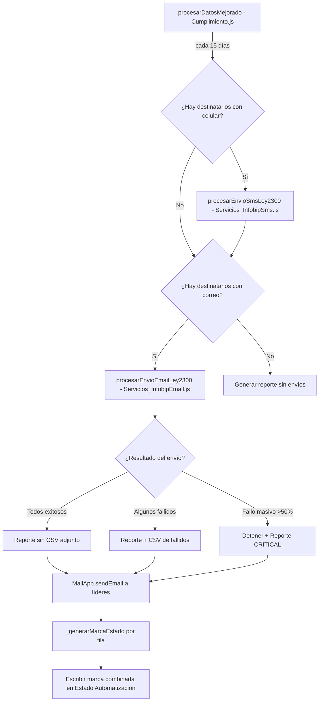
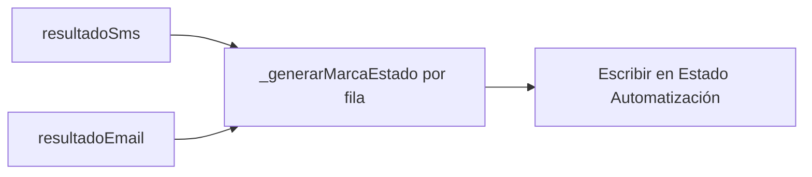
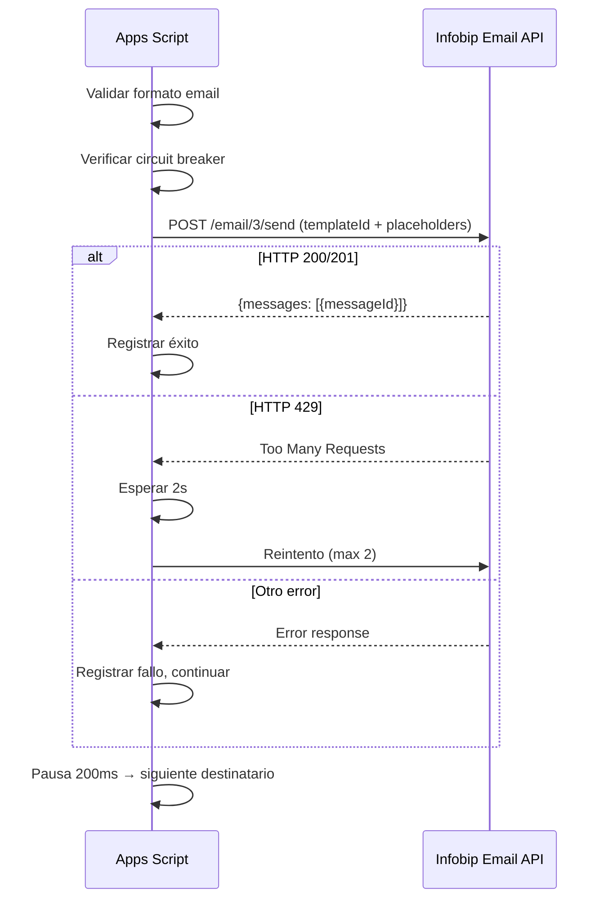

# Design Document: Automatizar Correos Ley 2300

## Overview

Este módulo automatiza el envío de correos electrónicos de cumplimiento de la Ley 2300 mediante la API de Email de Infobip, eliminando el flujo manual actual que requiere descargar un CSV y realizar envíos masivos externos.

**Decisión de diseño clave**: Se implementa como un módulo paralelo a `Servicios_InfobipSms.js`, siguiendo el mismo patrón arquitectónico (función individual de envío + función de procesamiento masivo + integración con `procesarDatosMejorado()`). Esto minimiza el riesgo de introducción y facilita el mantenimiento al tener ambos canales (SMS y Email) con estructura idéntica.

**API utilizada**: Infobip Email API v3 — endpoint `POST /email/3/send` con `Content-Type: multipart/form-data`. Se usa el parámetro `templateId` para referenciar la plantilla "CORREO LEY 2300" ya configurada en el portal de Infobip, enviando las variables de personalización (`{$firstName}`, `{$data Inmobiliaria}`) como placeholders por destinatario.

**Referencia**: [Infobip Send Fully Featured Email API](https://www.infobip.com/docs/api/channels/email/send-fully-featured-email) | [Email Templates over API](https://www.infobip.com/docs/email/email-templates/email-templates-over-api)

## Architecture



### Flujo de marcado combinado

El marcado en "Estado Automatización" ocurre **después** de que ambos canales (SMS y Email) completen su procesamiento. No se marca después de cada canal individualmente. La función `_generarMarcaEstado()` evalúa, fila por fila, qué canal(es) aplicaban a esa fila y cuál fue el resultado de cada uno para producir un texto único combinado.



**Detalle clave**: Cada fila de "registro analisis" tiene UNA persona con ALGUNO (o ambos) de los datos de contacto. La clasificación actual del código asigna cada persona a `datosCorreos` (tiene email) o `datosCelulares` (tiene teléfono). En el caso raro de que una persona tenga ambos, se procesaría por ambos canales. La marca para cada fila depende únicamente del resultado del canal o canales que aplican a esa fila.

### Secuencia de envío individual



### Posición en el flujo existente

El envío de emails se ejecuta **después** del envío de SMS y **antes** del reporte a líderes. El marcado en "Estado Automatización" ocurre **después** de que ambos canales completen, dentro del mismo lock de `procesarDatosMejorado()`:

1. Lock adquirido
2. Lectura de datos de "registro analisis"
3. Clasificación de contactos (correo vs celular)
4. **Envío SMS** (existente) → retorna `resultadoSms`
5. **Envío Email** (nuevo) → retorna `resultadoEmail`
6. Generación de reporte y envío a líderes
7. **Marcado combinado de filas** ← `_generarMarcaEstado()` por cada fila, usando `resultadoSms` + `resultadoEmail`
8. Lock liberado

## Components and Interfaces

### Nuevo archivo: `Servicios_InfobipEmail.js`

| Función | Visibilidad | Descripción |
|---------|-------------|-------------|
| `_enviarEmailInfobip(email, nombre, inmobiliaria)` | Privada | Envía un email individual usando la API de Infobip con templateId |
| `_validarFormatoEmail(email)` | Privada | Valida formato básico de dirección de correo |
| `_deduplicarDestinatarios(lista)` | Privada | Elimina duplicados por dirección de email, mantiene primera ocurrencia |
| `procesarEnvioEmailLey2300(datosCorreos)` | Pública | Punto de entrada: valida, deduplica, envía con rate limiting y circuit breaker |

### Interfaz de `_enviarEmailInfobip`

```javascript
/**
 * @param {string} email - Dirección de correo del destinatario
 * @param {string} nombre - Nombre del destinatario (placeholder {$firstName})
 * @param {string} inmobiliaria - Nombre de la inmobiliaria (placeholder {$data Inmobiliaria})
 * @returns {{ok: boolean, mensaje: string, statusCode?: number, messageId?: string}}
 */
```

### Interfaz de `procesarEnvioEmailLey2300`

```javascript
/**
 * @param {Array} datosCorreos - Array de filas: [['NOMBRE','CORREO','INMOBILIARIA'], ...datos]
 * @returns {{
 *   enviados: number,
 *   fallidos: number,
 *   invalidosFormato: number,
 *   duplicadosEliminados: number,
 *   errores: Array<{email: string, nombre: string, error: string}>,
 *   abortado: boolean
 * }}
 */
```

### Modificaciones a `Cumplimiento.js`

Se modifica `procesarDatosMejorado()` para:
1. Invocar `procesarEnvioEmailLey2300(datosCorreos)` después del envío SMS
2. **Diferir el marcado** hasta que ambos canales (SMS y Email) completen su procesamiento
3. Usar `_generarMarcaEstado()` para determinar el texto correcto por cada fila, basándose en los resultados combinados
4. Condicionar el adjunto CSV: solo se adjunta si hay fallidos
5. Actualizar el reporte HTML con métricas de email (enviados, fallidos, inválidos)
6. Incluir CSV de fallidos si existen

### Nueva función utilitaria: `_generarMarcaEstado`

```javascript
/**
 * Determina el texto de marca para la columna "Estado Automatización" de una fila,
 * basándose en qué canal(es) aplicaban a esa fila y si cada uno tuvo éxito o falló.
 *
 * @param {{ok: boolean}|null} resultadoSms - Resultado del SMS para esta fila, o null si no aplica
 * @param {{ok: boolean}|null} resultadoEmail - Resultado del email para esta fila, o null si no aplica
 * @param {string} fecha - Fecha formateada para incluir en la marca
 * @returns {string} Texto descriptivo para la columna "Estado Automatización"
 *
 * Reglas:
 * - Si persona solo tiene teléfono → resultadoEmail es null → marca depende solo de SMS
 * - Si persona solo tiene correo → resultadoSms es null → marca depende solo de Email
 * - Si persona tiene ambos → marca depende del resultado combinado
 */
function _generarMarcaEstado(resultadoSms, resultadoEmail, fecha) {
  const smsAplica = resultadoSms !== null;
  const emailAplica = resultadoEmail !== null;
  const smsOk = smsAplica ? resultadoSms.ok : null;
  const emailOk = emailAplica ? resultadoEmail.ok : null;

  // Ambos canales aplican
  if (smsAplica && emailAplica) {
    if (smsOk && emailOk) return `Procesado ${fecha}`;
    if (smsOk && !emailOk) return `Parcial ${fecha} · Email falló`;
    if (!smsOk && emailOk) return `Parcial ${fecha} · SMS falló`;
    return `Parcial ${fecha} · SMS y Email fallaron`;
  }

  // Solo SMS aplica
  if (smsAplica && !emailAplica) {
    return smsOk ? `Procesado ${fecha}` : `Parcial ${fecha} · SMS falló`;
  }

  // Solo Email aplica
  if (!smsAplica && emailAplica) {
    return emailOk ? `Procesado ${fecha}` : `Parcial ${fecha} · Email falló`;
  }

  // Ni SMS ni Email aplica (no debería ocurrir en flujo normal)
  return `Procesado ${fecha}`;
}
```

**Ubicación**: Se define en `Cumplimiento.js` como función privada (prefijo `_`), junto al resto de utilidades del módulo.

**Integración**: Después de que `procesarEnvioSmsLey2300()` y `procesarEnvioEmailLey2300()` retornan sus resultados, el loop de marcado itera por cada fila y:
1. Determina si esa fila tenía un contacto en `datosCelulares`, en `datosCorreos`, o en ambos
2. Busca el resultado de envío correspondiente en las listas de éxitos/fallos de cada canal
3. Llama a `_generarMarcaEstado(resultadoSmsParaFila, resultadoEmailParaFila, fechaMarca)` para obtener el texto
4. Escribe el texto en la celda "Estado Automatización" de esa fila

### Payload de la API de Infobip (Email v3)

```
POST {baseUrl}/email/3/send
Content-Type: multipart/form-data
Authorization: App {apiKey}

Form fields:
  from        = "El Libertador · Inducciones <{INFOBIP_EMAIL_FROM}>"
  to          = {"to": "destinatario@example.com", "placeholders": {"firstName": "Juan", "data Inmobiliaria": "Inmob XYZ"}}
  templateId  = {INFOBIP_EMAIL_TEMPLATE_ID}  (ID numérico de la plantilla "CORREO LEY 2300")
  subject     = "Información de canales de contacto · Ley 2300"
  replyTo     = "autorizacioncanalesdecontacto@ellibertador.co"
```

**Nota sobre `templateId`**: La plantilla "CORREO LEY 2300" se identifica por su ID numérico en Infobip. Este ID se almacena en Script Properties como `INFOBIP_EMAIL_TEMPLATE_ID`. Los placeholders `{$firstName}` y `{$data Inmobiliaria}` se pasan en el campo `placeholders` del objeto `to`.

## Data Models

### Valores de marca en "Estado Automatización"

Cada fila recibe UN texto en la columna "Estado Automatización" que refleja el resultado combinado de los canales que aplican a esa fila. La `{fecha}` es la fecha/hora del procesamiento en formato `yyyy-MM-dd HH:mm:ss`.

| Situación | Valor de texto |
|-----------|----------------|
| Todos los canales que aplican exitosos | `Procesado {fecha}` |
| SMS OK, Email falló (persona tenía ambos) | `Parcial {fecha} · Email falló` |
| Email OK, SMS falló (persona tenía ambos) | `Parcial {fecha} · SMS falló` |
| Ambos canales fallaron | `Parcial {fecha} · SMS y Email fallaron` |
| Solo tenía un canal y fue exitoso | `Procesado {fecha}` |
| Solo tenía un canal y falló | `Parcial {fecha} · {canal} falló` |

**Nota sobre clasificación de contactos por fila**: Cada fila en "registro analisis" contiene personas (arrendatario + hasta 5 codeudores). Cada persona tiene ALGUNO de los datos de contacto:
- Si la persona tiene teléfono pero NO email → se clasifica en `datosCelulares` → la marca de su fila depende solo del resultado de SMS
- Si la persona tiene email pero NO teléfono → se clasifica en `datosCorreos` → la marca de su fila depende solo del resultado de Email
- Si la persona tiene AMBOS (caso raro) → se procesa por ambos canales → la marca de su fila depende del resultado combinado

Una fila puede tener múltiples personas (arrendatario + codeudores), cada una potencialmente procesada por un canal distinto. La marca de la fila refleja el **peor caso** entre todas las personas de esa fila: si al menos una persona de la fila tuvo un fallo en algún canal, la fila se marca como "Parcial".

### Script Properties (configuración)

| Propiedad | Descripción | Ejemplo |
|-----------|-------------|---------|
| `INFOBIP_BASE_URL` | Base URL de la cuenta Infobip (ya existe para SMS) | `xxxxx.api.infobip.com` |
| `INFOBIP_API_KEY` | API key de Infobip (ya existe para SMS) | `abc123...` |
| `INFOBIP_EMAIL_FROM` | Dirección de remitente verificada en Infobip | `noreply@ellibertador.co` |
| `INFOBIP_EMAIL_TEMPLATE_ID` | ID numérico de la plantilla "CORREO LEY 2300" | `12345` |

### Estructura de datos internos

```javascript
// Entrada (del flujo existente en Cumplimiento.js)
datosCorreos = [
  ['NOMBRE', 'CORREO', 'INMOBILIARIA'],  // header
  ['Juan Pérez', 'juan@example.com', 'Inmobiliaria ABC'],
  ['María López', 'maria@test.co', 'Inmobiliaria XYZ'],
  // ...
];

// Resultado del procesamiento
resultadoEmail = {
  enviados: 15,
  fallidos: 2,
  invalidosFormato: 1,
  duplicadosEliminados: 3,
  errores: [
    { email: 'bad@invalid', nombre: 'Carlos', error: 'Infobip respondió 400: invalid recipient' },
    { email: 'otro@test.co', nombre: 'Ana', error: 'Error de red: timeout' }
  ],
  abortado: false  // true si se activó el circuit breaker
};
```

### Respuesta esperada de Infobip (éxito)

```json
{
  "messages": [
    {
      "to": "destinatario@example.com",
      "messageCount": 1,
      "messageId": "abc123-def456-ghi789",
      "status": {
        "groupId": 1,
        "groupName": "PENDING",
        "id": 26,
        "name": "MESSAGE_ACCEPTED",
        "description": "Message sent to next instance"
      }
    }
  ]
}
```

## Correctness Properties

*A property is a characteristic or behavior that should hold true across all valid executions of a system — essentially, a formal statement about what the system should do. Properties serve as the bridge between human-readable specifications and machine-verifiable correctness guarantees.*

### Property 1: Placeholder mapping correctness

*For any* destinatario con un nombre y una inmobiliaria (strings no vacíos), el payload construido para la API de Infobip SHALL contener ambos valores exactos mapeados a los placeholders `firstName` y `data Inmobiliaria` respectivamente, sin transformación ni truncamiento.

**Validates: Requirements 1.2, 2.2**

### Property 2: Batch resilience — individual failures don't halt processing

*For any* lista de N destinatarios válidos donde algunos envíos fallan con errores individuales (HTTP 4xx distintos de 429, o errores de red), el sistema SHALL intentar enviar a todos los N destinatarios (a menos que se active el circuit breaker), sin detenerse ante fallos individuales.

**Validates: Requirements 3.2**

### Property 3: Circuit breaker activation

*For any* secuencia de envíos donde más del 50% del total del Corte falla de forma consecutiva, el sistema SHALL detener el procesamiento de los destinatarios restantes y marcar el resultado como `abortado: true`.

**Validates: Requirements 3.5**

### Property 4: Email validation filtering

*For any* lista de destinatarios que contiene direcciones con formato inválido (sin `@`, sin dominio con punto, vacías), el sistema SHALL excluir esas direcciones del envío y contabilizarlas en `invalidosFormato`. El número de intentos de envío SHALL ser igual al número de destinatarios con formato válido después de deduplicación.

**Validates: Requirements 5.1, 5.2**

### Property 5: Deduplication correctness

*For any* lista de destinatarios con N entradas donde K son direcciones de email únicas (con formato válido), el sistema SHALL enviar exactamente K correos y reportar `duplicadosEliminados` igual a (N - invalidosFormato - K). Ningún destinatario válido SHALL ser eliminado por la deduplicación.

**Validates: Requirements 5.3, 5.4**

### Property 6: Failure reporting completeness

*For any* ejecución del Corte con destinatarios fallidos, el CSV generado SHALL contener exactamente los datos (nombre, correo, inmobiliaria) de cada destinatario cuyo envío falló, sin omisiones ni entradas adicionales.

**Validates: Requirements 4.3, 4.5**

### Property 7: Counts invariant

*For any* ejecución del procesamiento de emails, la suma `enviados + fallidos` SHALL ser igual al número total de destinatarios que se intentaron enviar (es decir, válidos y deduplicados, menos los no procesados por circuit breaker si aplica). La suma `enviados + fallidos + invalidosFormato + duplicadosEliminados` SHALL ser menor o igual al total de entradas originales.

**Validates: Requirements 7.2**

### Property 8: Marking correctness — combined outcome reflection

*For any* fila procesada con una combinación de resultados de SMS y Email (éxito/fallo/no aplica por cada canal), el texto escrito en la columna "Estado Automatización" por `_generarMarcaEstado()` SHALL reflejar correctamente el resultado combinado: "Procesado {fecha}" cuando todos los canales que aplican fueron exitosos, "Parcial {fecha} · {canal} falló" cuando exactamente un canal falló, y "Parcial {fecha} · SMS y Email fallaron" cuando ambos canales fallaron. Si solo un canal aplica a la fila, el texto SHALL ser "Procesado {fecha}" si ese canal fue exitoso, o "Parcial {fecha} · {canal} falló" si ese canal falló.

**Validates: Requirements 1.3, 7.4, 7.6**

## Error Handling

### Principio de separación de información de error

Los detalles de errores de envío (motivo del fallo, código HTTP, dirección del destinatario) se registran **exclusivamente** en:
1. **Logs_Sistema** (hoja de auditoría): registro técnico completo para trazabilidad
2. **Reporte por correo a líderes**: resumen de fallidos + CSV adjunto con datos para gestión manual

La columna "Estado Automatización" en "registro analisis" **NUNCA** contiene detalles de error. Solo contiene los textos predefinidos (`Procesado {fecha}` o `Parcial {fecha} · {canal} falló`) que indican el resultado a alto nivel sin exponer información técnica.

### Estrategia por nivel de error

| Nivel | Condición | Acción |
|-------|-----------|--------|
| **Config** | Faltan `INFOBIP_BASE_URL`, `INFOBIP_API_KEY`, `INFOBIP_EMAIL_FROM` o `INFOBIP_EMAIL_TEMPLATE_ID` | Log CRITICAL, retornar `{enviados:0, fallidos:0, abortado:true}`, no intentar envíos |
| **Individual** | HTTP 4xx (≠429), 5xx, error de red | Log WARN con detalle, agregar a lista de errores, continuar al siguiente |
| **Rate limit** | HTTP 429 | Esperar 2s, reintentar hasta 2 veces. Si persiste, registrar como fallo individual |
| **Masivo** | >50% consecutivos fallan | Log CRITICAL, detener envíos, marcar `abortado:true`, incluir alerta en reporte |
| **Excepción no capturada** | Error en `procesarEnvioEmailLey2300` | try/catch en Cumplimiento.js atrapa el error, log ERROR, el flujo SMS/marcado no se afecta |

### Circuit Breaker — Lógica detallada

```javascript
// Pseudocódigo del circuit breaker
let fallosConsecutivos = 0;
const umbralAbort = Math.ceil(totalDestinatarios * 0.5);

for (destinatario of listaValida) {
  resultado = _enviarEmailInfobip(...);
  if (resultado.ok) {
    fallosConsecutivos = 0;  // reset en éxito
    enviados++;
  } else {
    fallosConsecutivos++;
    fallidos++;
    if (fallosConsecutivos >= umbralAbort) {
      // ABORT — probable problema sistémico
      abortado = true;
      break;
    }
  }
}
```

### Retry logic para HTTP 429

```javascript
// Pseudocódigo del reintento
const MAX_REINTENTOS = 2;
const PAUSA_429 = 2000; // ms

for (let intento = 0; intento <= MAX_REINTENTOS; intento++) {
  response = UrlFetchApp.fetch(url, options);
  if (response.getResponseCode() !== 429) break;
  if (intento < MAX_REINTENTOS) Utilities.sleep(PAUSA_429);
}
```

### Aislamiento de errores en el flujo principal

```javascript
// En procesarDatosMejorado() — Cumplimiento.js
var resultadoEmail = { enviados: 0, fallidos: 0, invalidosFormato: 0, duplicadosEliminados: 0, errores: [], abortado: false };
if (datosCorreos.length > 1) {
  try {
    resultadoEmail = procesarEnvioEmailLey2300(datosCorreos);
  } catch (err) {
    _registrarEvento_("ERROR", "Cumplimiento.js", "Error crítico en envío email Ley 2300", err.message);
    // El flujo continúa — SMS ya enviados, marcado de filas procede
  }
}
```

## Testing Strategy

### Property-Based Tests (fast-check + vitest)

Se usa **fast-check** (ya instalado en el proyecto) como librería de PBT con **vitest** como runner. Cada propiedad del diseño se implementa como un test con mínimo 100 iteraciones.

| Property | Archivo de test | Generadores |
|----------|----------------|-------------|
| 1: Placeholder mapping | `tests/properties/infobip-email.property.test.js` | Strings arbitrarios para nombre/inmobiliaria |
| 2: Batch resilience | `tests/properties/infobip-email.property.test.js` | Arrays de resultados boolean (éxito/fallo) |
| 3: Circuit breaker | `tests/properties/infobip-email.property.test.js` | Secuencias de éxito/fallo con posiciones de fallos consecutivos |
| 4: Email validation | `tests/properties/infobip-email.property.test.js` | Strings arbitrarios + emails válidos generados |
| 5: Deduplication | `tests/properties/infobip-email.property.test.js` | Arrays con duplicados intencionales |
| 6: Failure reporting | `tests/properties/infobip-email.property.test.js` | Arrays de objetos error con datos aleatorios |
| 7: Counts invariant | `tests/properties/infobip-email.property.test.js` | Combinaciones de listas con válidos/inválidos/duplicados |
| 8: Marking correctness | `tests/properties/infobip-email.property.test.js` | Combinaciones de {ok:boolean}\|null para SMS y Email por fila |

**Configuración**:
- Mínimo 100 iteraciones por property test
- Tag format: `Feature: automatizar-correos-ley-2300, Property {N}: {título}`
- Mocks de `UrlFetchApp`, `PropertiesService`, `Utilities`, `_registrarEvento_`

### Unit Tests (vitest)

Tests de ejemplo y edge cases:

| Caso | Tipo |
|------|------|
| Envío exitoso con HTTP 200 → messageId registrado | Example |
| Envío con plantilla no encontrada → clasificado como fallido | Example |
| Retry en HTTP 429 → éxito en segundo intento | Example |
| Credenciales faltantes → retorno inmediato con error | Smoke |
| `from` contiene dirección de INFOBIP_EMAIL_FROM | Smoke |
| `replyTo` es `autorizacioncanalesdecontacto@ellibertador.co` | Smoke |
| `templateId` está presente en el payload | Smoke |
| Error en email module no rompe flujo SMS | Example |
| Reporte sin CSV cuando todos exitosos | Example |
| Reporte con CSV cuando hay fallidos | Example |

### Integration Tests

| Escenario |
|-----------|
| `procesarDatosMejorado` invoca email después de SMS |
| Orden de ejecución: SMS → Email → Reporte |
| Lock compartido (no lock adicional en email) |

### Generadores personalizados

```javascript
// Generador de emails válidos
const validEmail = fc.tuple(
  fc.stringOf(fc.constantFrom(...'abcdefghijklmnopqrstuvwxyz0123456789'.split('')), {minLength: 1, maxLength: 20}),
  fc.stringOf(fc.constantFrom(...'abcdefghijklmnopqrstuvwxyz'.split('')), {minLength: 2, maxLength: 10}),
  fc.constantFrom('com', 'co', 'org', 'net', 'io')
).map(([user, domain, tld]) => `${user}@${domain}.${tld}`);

// Generador de emails inválidos
const invalidEmail = fc.oneof(
  fc.constant(''),
  fc.stringOf(fc.char(), {minLength: 1, maxLength: 30}).filter(s => !s.includes('@')),
  fc.string().map(s => s + '@'),  // sin dominio
  fc.string().map(s => '@' + s.replace(/\./g, ''))  // sin punto en dominio
);

// Generador de secuencia de resultados (para circuit breaker)
const sendResultSequence = (n) => fc.array(fc.boolean(), {minLength: n, maxLength: n});
```

