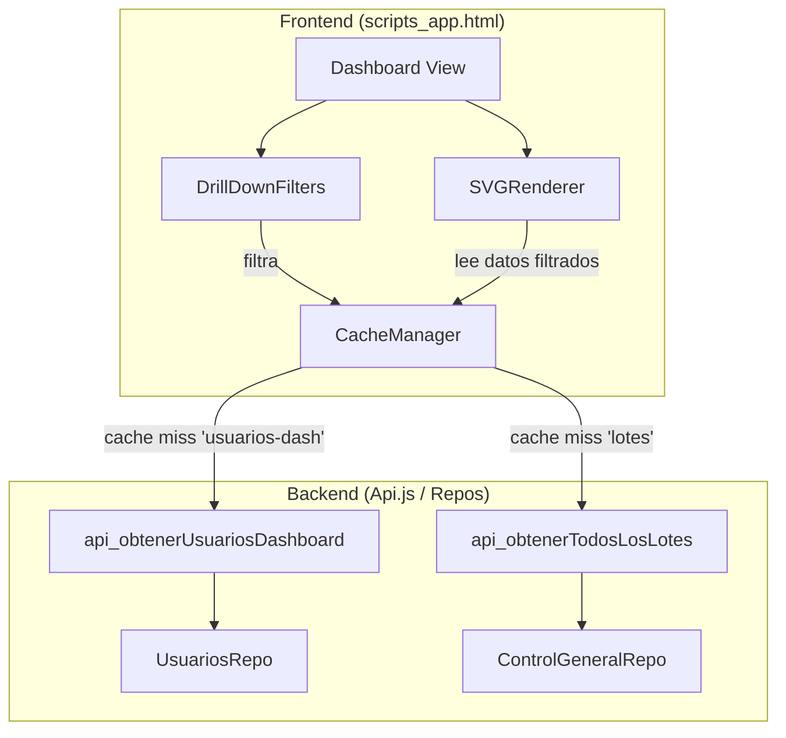
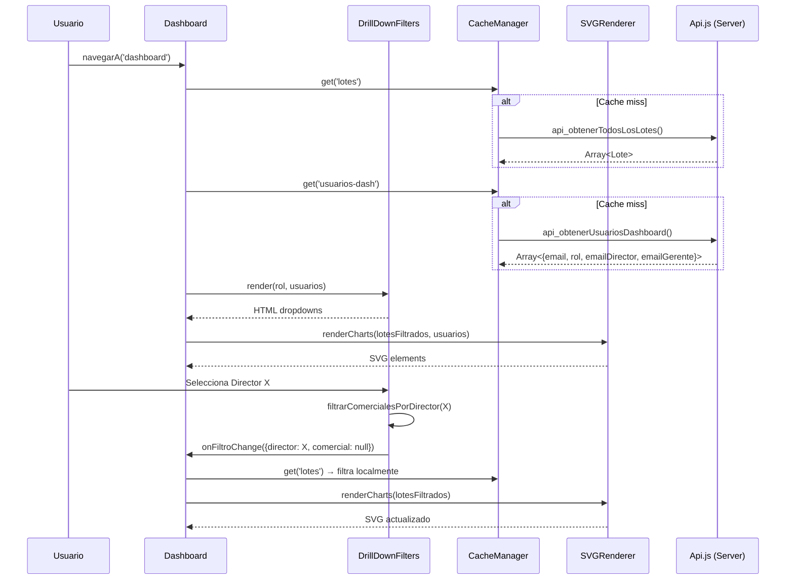

# Design Document: Dashboard Filtros y Gráficos

## Overview

Este diseño agrega un sistema de filtros drill-down y 3 gráficos SVG analíticos al dashboard existente del sistema "El Libertador". Los filtros permiten a roles de supervisión (GERENTE, DIRECTOR, ADMIN, ASESOR) segmentar datos por Director y/o Comercial. Los gráficos (Ranking, Antigüedad, Tendencia) se renderizan como SVG inline con vanilla JS, operando 100% sobre datos ya cacheados en el frontend via `CacheManager`.

**Decisiones clave de diseño:**
- No se crean endpoints nuevos de servidor. Todo el filtrado y cálculo de gráficos opera sobre `CacheManager.get('lotes')` y un nuevo cache `CacheManager.get('usuarios')`.
- Los gráficos se generan con `document.createElementNS` (SVG nativo), sin dependencias externas.
- La cascada Director → Comercial se resuelve en frontend usando los datos de jerarquía que ya expone `api_obtenerUsuarios` (o un nuevo endpoint liviano que solo retorne emails+roles+jerarquía).

## Architecture

### Diagrama de alto nivel



### Flujo de datos



## Components and Interfaces

### 1. DrillDownFilters (Frontend Module)

Componente encargado de renderizar los dropdowns de filtro y gestionar la lógica de cascada.

```javascript
/**
 * @typedef {Object} FiltroState
 * @property {string|null} director - Email del director seleccionado, null = "Todos"
 * @property {string|null} comercial - Email del comercial seleccionado, null = "Todos"
 */

var DrillDownFilters = {
  /** Estado actual del filtro */
  _state: { director: null, comercial: null },

  /**
   * Renderiza los dropdowns según el rol del usuario.
   * @param {string} rol - Rol del usuario logueado (GERENTE, DIRECTOR, ADMIN, ASESOR, etc.)
   * @param {Array<UsuarioDash>} usuarios - Lista de usuarios cacheados
   * @param {string} emailUsuario - Email del usuario logueado
   * @returns {string} HTML de los filtros
   */
  render: function(rol, usuarios, emailUsuario) { /* ... */ },

  /**
   * Retorna los emails de comerciales visibles según la selección actual.
   * Usado para filtrar lotes localmente.
   * @param {Array<UsuarioDash>} usuarios
   * @returns {string[]|null} Array de emails o null (sin filtro)
   */
  getEmailsFiltrados: function(usuarios) { /* ... */ },

  /**
   * Handler de cambio en Filtro Director. Refresca el Filtro Comercial.
   * @param {string} emailDirector - Email seleccionado o '' para "Todos"
   */
  onDirectorChange: function(emailDirector) { /* ... */ },

  /**
   * Handler de cambio en Filtro Comercial. Trigger de re-render.
   * @param {string} emailComercial - Email seleccionado o '' para "Todos"
   */
  onComercialChange: function(emailComercial) { /* ... */ },

  /**
   * Obtiene la lista de directores para popular el dropdown según el rol.
   * @param {string} rol
   * @param {string} emailUsuario
   * @param {Array<UsuarioDash>} usuarios
   * @returns {Array<{email: string, nombre: string}>}
   */
  _getDirectoresVisibles: function(rol, emailUsuario, usuarios) { /* ... */ },

  /**
   * Obtiene la lista de comerciales según el director seleccionado.
   * @param {string|null} emailDirector
   * @param {string} rol
   * @param {string} emailUsuario
   * @param {Array<UsuarioDash>} usuarios
   * @returns {Array<{email: string, nombre: string}>}
   */
  _getComercialesVisibles: function(emailDirector, rol, emailUsuario, usuarios) { /* ... */ }
};
```

### 2. SVGRenderer (Frontend Module)

Módulo que genera gráficos SVG inline sin dependencias externas.

```javascript
var SVGRenderer = {
  /**
   * Genera un gráfico de barras horizontales (ranking/antigüedad).
   * @param {Object} config
   * @param {string} config.containerId - ID del div contenedor
   * @param {string} config.titulo - Título descriptivo para accesibilidad
   * @param {Array<{label: string, valor: number}>} config.datos - Datos a graficar
   * @param {Object} [config.opciones]
   * @param {string} [config.opciones.colorBarra] - Color CSS de las barras
   * @param {number} [config.opciones.umbralAlerta] - Valor encima del cual se resalta
   * @param {string} [config.opciones.colorAlerta] - Color para barras que superen umbral
   * @param {string} [config.opciones.sufijo] - Sufijo para los valores (ej: " días")
   */
  barrasHorizontales: function(config) { /* ... */ },

  /**
   * Genera un gráfico de línea (tendencia semanal).
   * @param {Object} config
   * @param {string} config.containerId - ID del div contenedor
   * @param {string} config.titulo - Título descriptivo para accesibilidad
   * @param {Array<{label: string, valor: number}>} config.datos - Puntos de la línea
   */
  lineaTendencia: function(config) { /* ... */ },

  /**
   * Crea un elemento SVG con namespace correcto.
   * @param {string} tag - Nombre del elemento SVG
   * @param {Object} attrs - Atributos a asignar
   * @returns {SVGElement}
   */
  _crearElemento: function(tag, attrs) { /* ... */ },

  /**
   * Calcula el viewBox adecuado para un contenedor dado.
   * @param {number} ancho - Ancho lógico del SVG
   * @param {number} alto - Alto lógico del SVG
   * @returns {string} Valor del atributo viewBox
   */
  _calcularViewBox: function(ancho, alto) { /* ... */ }
};
```

### 3. DashboardCharts (Frontend Module)

Orquestador que conecta los datos filtrados con el SVGRenderer.

```javascript
var DashboardCharts = {
  /**
   * Renderiza los 3 gráficos del dashboard con los datos filtrados actuales.
   * @param {Array<Lote>} lotes - Lotes ya filtrados por DrillDownFilters
   * @param {Array<UsuarioDash>} usuarios - Lista de usuarios para nombres
   */
  renderizar: function(lotes, usuarios) { /* ... */ },

  /**
   * Calcula datos para el Chart_Ranking.
   * Cuenta lotes radicados en el mes actual por comercial.
   * @param {Array<Lote>} lotes
   * @param {Array<UsuarioDash>} usuarios
   * @returns {Array<{label: string, valor: number}>}
   */
  _calcularRanking: function(lotes, usuarios) { /* ... */ },

  /**
   * Calcula datos para el Chart_Antiguedad.
   * Promedio de días por estado (solo lotes no terminados).
   * @param {Array<Lote>} lotes
   * @returns {Array<{label: string, valor: number}>}
   */
  _calcularAntiguedad: function(lotes) { /* ... */ },

  /**
   * Calcula datos para el Chart_Tendencia.
   * Lotes radicados por semana (últimas 8 semanas).
   * @param {Array<Lote>} lotes
   * @returns {Array<{label: string, valor: number}>}
   */
  _calcularTendencia: function(lotes) { /* ... */ }
};
```

### 4. api_obtenerUsuariosDashboard (Backend Endpoint)

Nuevo endpoint liviano que retorna solo los datos de jerarquía necesarios para los filtros (sin exponer campos sensibles).

```javascript
/**
 * Retorna datos mínimos de usuarios para popular filtros en el dashboard.
 * Filtrado por vista jerárquica del solicitante.
 * @returns {Array<{email: string, nombre: string, rol: string, emailDirector: string, emailGerente: string, activo: boolean}>}
 */
function api_obtenerUsuariosDashboard() {
  // verificarRol → getEmailsEquipoVisible → filtrar → retornar campos mínimos
}
```

**Decisión de diseño:** Se crea un endpoint separado de `api_obtenerUsuarios` porque:
1. `api_obtenerUsuarios` solo es accesible por DIRECTOR+ y retorna campos de gestión (cupo, emailsAlternos).
2. El nuevo endpoint es accesible por GERENTE, DIRECTOR, ADMIN, ASESOR y retorna solo lo necesario para filtros.
3. El payload es más liviano (sin cupo, sin emailsAlternos).

## Data Models

### UsuarioDash (Frontend cache)

```javascript
/**
 * Modelo ligero de usuario para filtros del dashboard.
 * Se cachea en CacheManager bajo clave 'usuarios-dash'.
 * @typedef {Object} UsuarioDash
 * @property {string} email - Email primario
 * @property {string} nombre - Nombre legible derivado del email
 * @property {string} rol - CONSULTOR|DIRECTOR|GERENTE|ADMIN|ASESOR|AUXILIAR|ANALISTA
 * @property {string} emailDirector - Email del director supervisor
 * @property {string} emailGerente - Email del gerente supervisor
 * @property {boolean} activo - Si está activo
 */
```

### Lote (ya existente en CacheManager['lotes'])

```javascript
/**
 * Modelo de lote tal como llega de api_obtenerTodosLosLotes.
 * @typedef {Object} Lote
 * @property {string} idLote - ID único del lote
 * @property {string} fecha - Fecha formateada "d/MM/yyyy HH:mm"
 * @property {string} comercial - Nombre del comercial (MAYÚSCULAS)
 * @property {number} contratos - Cantidad de contratos en el lote
 * @property {Object<string, number>} estados - Mapa estado→cantidad
 * @property {string} estadoPrincipal - Estado dominante del lote
 */
```

### FiltroState (Frontend state)

```javascript
/**
 * Estado interno de los filtros drill-down.
 * @typedef {Object} FiltroState
 * @property {string|null} director - Email del director seleccionado (null = Todos)
 * @property {string|null} comercial - Email del comercial seleccionado (null = Todos)
 */
```

### Datos derivados para gráficos

```javascript
/**
 * Punto de datos para un gráfico de barras o línea.
 * @typedef {Object} ChartDataPoint
 * @property {string} label - Etiqueta (nombre comercial, estado, rango de fechas)
 * @property {number} valor - Valor numérico a representar
 */
```

### TTL de CacheManager

Se agrega una nueva clave al `_ttls` del CacheManager existente:

| Clave | TTL | Descripción |
|-------|-----|-------------|
| `'usuarios-dash'` | 0 (sin expiración en sesión) | Lista de usuarios para filtros. Se invalida manualmente si se editan usuarios. |
| `'lotes'` | 0 (ya existente) | Todos los lotes del equipo visible. Ya existe en el sistema. |
| `'dashboard'` | 30000 (ya existente) | Resumen de KPIs. Ya existe en el sistema. |


## Correctness Properties

*A property is a characteristic or behavior that should hold true across all valid executions of a system — essentially, a formal statement about what the system should do. Properties serve as the bridge between human-readable specifications and machine-verifiable correctness guarantees.*

### Property 1: Filter visibility is determined by role

*For any* user role, the DrillDownFilters render function SHALL produce output that matches the role-based visibility specification:
- GERENTE, ADMIN, ASESOR → both Director and Comercial dropdowns rendered
- DIRECTOR → only Comercial dropdown rendered
- CONSULTOR, COMERCIAL, AUXILIAR, ANALISTA → no dropdowns rendered (component hidden)

**Validates: Requirements 1.1, 1.2, 1.3, 1.4**

### Property 2: Director list population respects hierarchy

*For any* list of users and *for any* requesting user (with their role and email), the returned list of directors SHALL satisfy:
- If requester is GERENTE: only directors where `emailGerente === requester.email` AND `activo === true`
- If requester is ADMIN or ASESOR: all users where `rol === 'DIRECTOR'` AND `activo === true`
- No director with `activo === false` SHALL appear in any case
- The result set SHALL be a subset of the input user list

**Validates: Requirements 2.1, 2.2**

### Property 3: Comercial list population with cascade

*For any* list of users, *for any* selected director email (or null for "Todos"), and *for any* requesting user (role + email), the returned list of comercials SHALL satisfy:
- If a specific director is selected: only users where `emailDirector === selectedDirector` AND `activo === true`
- If "Todos" is selected (director = null) and requester is GERENTE: all comercials transitively visible to the gerente (through their directors)
- If requester is DIRECTOR (no director filter): only users where `emailDirector === requester.email` AND `activo === true`
- On any director selection change, the comercial selection SHALL reset to null ("Todos")

**Validates: Requirements 3.1, 3.2, 3.3, 4.1, 4.2**

### Property 4: Lote filtering produces correct subset

*For any* list of lotes and *for any* non-empty set of comercial names (derived from selected team), the filtered lote list SHALL satisfy:
- Every lote in the result has its `comercial` field matching (case-insensitive) one of the names in the selected set
- No lote outside the result has a `comercial` field matching any name in the selected set
- The result is a subset of the input list (no fabricated lotes)

**Validates: Requirements 5.3**

### Property 5: Ranking calculation produces sorted results with full team coverage

*For any* list of lotes and *for any* list of comercials in the filtered team, the ranking calculation SHALL satisfy:
- The output contains exactly one entry per comercial in the team (including those with zero count)
- The output is sorted in descending order by `valor` (volume)
- Each `valor` equals the count of lotes where: `fecha` is in the current calendar month AND `estado` is "RADICADO" or a downstream state (EN ANÁLISIS, PENDIENTE PAZ Y SALVO, TERMINADO, etc.)
- Lotes whose fecha is NOT in the current month are NOT counted

**Validates: Requirements 6.2, 6.3, 6.4, 6.6**

### Property 6: Antigüedad calculation produces correct averages with alert detection

*For any* list of lotes with valid dates, the antigüedad calculation SHALL satisfy:
- The output contains one entry per unique `estado` that has at least one active (non-TERMINADO) lote
- The estado "TERMINADO" SHALL NOT appear in the output
- Each entry's `valor` equals the arithmetic mean of `floor((now - fecha) / msPerDay)` for all lotes in that estado, rounded to 1 decimal
- If `valor > 5`, the entry SHALL be flagged for alert highlighting
- If `valor <= 5`, the entry SHALL NOT be flagged

**Validates: Requirements 7.2, 7.3, 7.6**

### Property 7: Tendencia produces exactly 8 weekly buckets with correct counts

*For any* list of lotes with valid dates, the tendencia calculation SHALL satisfy:
- The output has exactly 8 entries (one per complete calendar week, most recent last)
- Each entry's `valor` equals the count of lotes where: `fecha` falls within that week's Monday–Sunday range AND `estado` is "RADICADO" or a downstream state
- A lote counted in one week SHALL NOT be counted in any other week
- The 8 weeks SHALL be consecutive and end with the most recently completed week

**Validates: Requirements 8.2, 8.3**

### Property 8: SVG accessibility attributes are always present

*For any* chart rendered by SVGRenderer (ranking, antigüedad, or tendencia), the generated SVG element SHALL satisfy:
- The root `<svg>` element has `role="img"`
- The root `<svg>` element has an `aria-labelledby` attribute referencing a valid ID
- A `<title>` element exists within the SVG with a non-empty text description
- The `<title>` element's `id` matches the `aria-labelledby` reference

**Validates: Requirements 10.1, 10.2**

## Error Handling

| Escenario | Comportamiento esperado |
|-----------|------------------------|
| CacheManager.get('lotes') retorna null al cargar dashboard | Se invoca `api_obtenerTodosLosLotes`, se cachea resultado, luego se aplican filtros. Se muestra skeleton durante la carga. |
| CacheManager.get('usuarios-dash') retorna null | Se invoca `api_obtenerUsuariosDashboard`, se cachea, luego se populan filtros. Filtros muestran skeleton/placeholder. |
| api_obtenerTodosLosLotes falla (timeout/error) | Se muestra mensaje de error con botón "Reintentar". Los filtros y gráficos no se renderizan. |
| api_obtenerUsuariosDashboard falla | Los filtros no se muestran. El dashboard funciona con KPIs existentes pero sin drill-down ni gráficos. Toast informativo. |
| Lista de lotes está vacía (0 lotes) | Los gráficos muestran estado vacío con mensaje "No hay datos para el período seleccionado". |
| Director seleccionado no tiene comerciales | Filtro_Comercial muestra solo opción "Todos". Chart_Ranking muestra estado vacío. |
| Lote tiene fecha inválida (no es Date) | Se excluye del cálculo de antigüedad y tendencia. No se propaga error. |
| Usuario cambia de sección mientras se carga 'usuarios-dash' | Se usa `_navId` para descartar respuestas tardías (patrón existente en el SPA). |
| SVG container no existe en DOM (race condition) | SVGRenderer verifica existencia de container antes de insertar. Si no existe, no renderiza (fail-safe silencioso). |

## Testing Strategy

### Unit Tests (Example-based)

Los tests unitarios cubren escenarios específicos y casos borde:

1. **DrillDownFilters.render** — Verificar HTML correcto para cada rol específico
2. **Opción "Todos" siempre presente** — Primer option de cada dropdown es "Todos"
3. **Cache miss → server call** — Mock de CacheManager + callServer para verificar flujo
4. **SVG namespace** — Verificar que createElementNS usa `http://www.w3.org/2000/svg`
5. **viewBox y width responsivo** — SVG tiene width="100%" y viewBox definido
6. **Contraste de color WCAG AA** — Verificar colores usados vs fondo blanco
7. **Tendencia siempre 8 puntos** — Con 0 lotes, con lotes fuera de rango, etc.
8. **Marcadores circulares en Chart_Tendencia** — SVG contiene `<circle>` en cada data point
9. **Recalculate on filter change** — Integration: cambio de filtro → re-render de charts

### Property-Based Tests

Los tests de propiedades verifican invariantes universales usando [fast-check](https://github.com/dubzzz/fast-check) (o equivalente compatible con el entorno de test).

**Configuración:**
- Mínimo 100 iteraciones por propiedad
- Cada test referencia su propiedad del design document
- Tag format: `Feature: dashboard-filtros-graficos, Property {N}: {title}`

| Property # | Título | Generadores |
|-----------|--------|-------------|
| 1 | Filter visibility by role | Genera rol aleatorio del enum [GERENTE, DIRECTOR, ADMIN, ASESOR, CONSULTOR, COMERCIAL, AUXILIAR, ANALISTA] |
| 2 | Director list population | Genera lista de 1-50 usuarios con roles, emails y flags activo aleatorios |
| 3 | Comercial list cascade | Genera lista de usuarios + estado de filtro (director seleccionado o null) |
| 4 | Lote filtering | Genera lista de 0-100 lotes con nombres aleatorios + set de nombres seleccionados |
| 5 | Ranking calculation | Genera lista de lotes con fechas (dentro/fuera del mes) y estados variados + lista de comerciales |
| 6 | Antigüedad calculation | Genera lista de lotes con fechas variadas (1-60 días atrás) y estados aleatorios |
| 7 | Tendencia bucketing | Genera lista de lotes con fechas en rango de 0-12 semanas atrás |
| 8 | SVG accessibility | Genera datos aleatorios para cada tipo de gráfico, verifica atributos a11y |

### Framework de Testing

- **Runner:** Jest (ya configurado en el proyecto via `package.json`)
- **PBT Library:** fast-check (compatible con Jest, ligero, maduro)
- **Mocks:** JSDOM para `document.createElementNS` en tests de SVGRenderer
- **Cobertura:** Los 8 property tests + ~9 example tests cubren los 10 requirements
