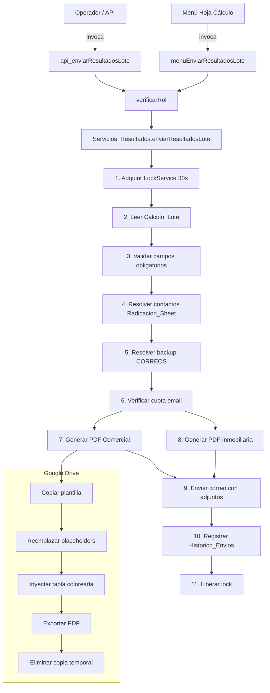
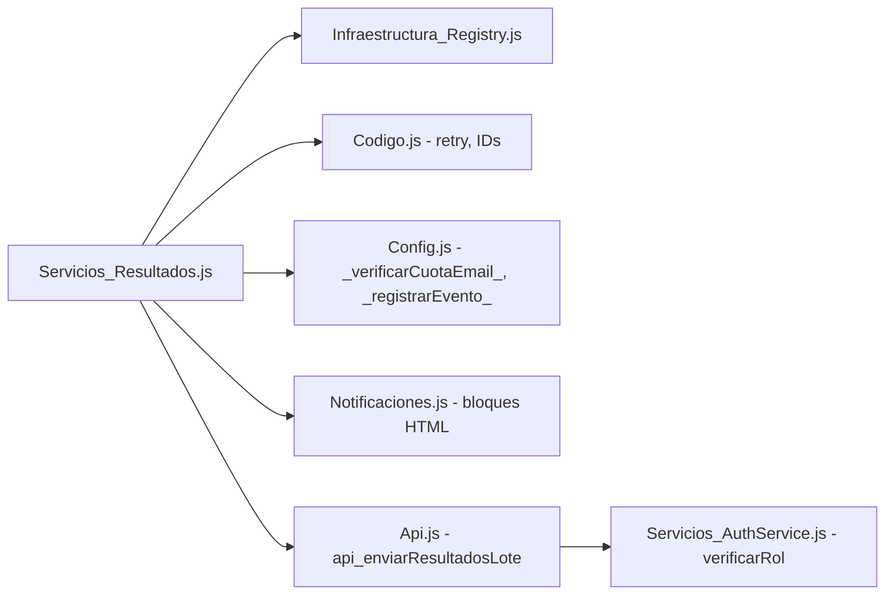

# Design Document: Generación de PDFs y Correos de Resultados

## Overview

Este módulo orquesta la generación de dos PDFs de resultado (comercial e inmobiliaria) a partir de plantillas Google Docs con reemplazo de placeholders y tablas coloreadas por estado, seguido del envío de un correo al ejecutivo comercial con ambos adjuntos y copia a la cadena jerárquica. Se integra completamente con la arquitectura existente del proyecto: SpreadsheetRegistry, retry(), _registrarEvento_, _verificarCuotaEmail_, bloques HTML de Notificaciones.js y LockService para concurrencia.

El flujo se expone por dos canales:
1. **API (`api_enviarResultadosLote`)**: Invocable desde el frontend con verificación de roles.
2. **Menú personalizado**: Ítem en la barra del libro de análisis para ejecución manual directa.

### Decisiones clave de diseño

| Decisión | Rationale |
|----------|-----------|
| Un solo módulo `Servicios_Resultados.js` | Sigue el patrón Servicios_*.js del proyecto — orquestación sin mezclar con repositorios |
| IDs de plantillas como `var` globales en Codigo.js | Consistente con `ID_HOJA_CONTROL`, `ID_ARCHIVO_ANALISIS` |
| Función de generación de PDF reutilizable | Ambos PDFs siguen el mismo pipeline (copiar → placeholders → tabla → exportar → eliminar) |
| LockService con timeout de 30s | Evita que dos ejecuciones simultáneas generen PDFs duplicados |
| CC deduplicado con Set | Evita correos duplicados cuando Director = Backup o aparece en CC_Fijo |

## Architecture



### Diagrama de dependencias entre módulos



## Components and Interfaces

### 1. Variables globales (en Codigo.js)

```javascript
var ID_RADICACION_SHEET   = "<ID_del_libro_radicacion>";
var ID_PLANTILLA_COMERCIAL = "<ID_del_doc_plantilla_comercial>";
var ID_PLANTILLA_INMOBILIARIA = "<ID_del_doc_plantilla_inmobiliaria>";
var CC_FIJO_RESULTADOS = ["correo1@ellibertador.co", "correo2@ellibertador.co"];
```

### 2. Servicios_Resultados.js — Funciones públicas

```javascript
/**
 * Orquesta la generación de PDFs y envío del correo de resultados.
 * Punto de entrada principal invocado por API y menú.
 *
 * @returns {{ok: boolean, mensaje: string}}
 * @sheets_read 3-4 (Calculo_Lote, Radicacion_Sheet, CORREOS, Historico_Envios)
 * @sheets_write 1 (Historico_Envios)
 */
function enviarResultadosLote() {}

/**
 * Handler del menú personalizado. Valida rol via Session y ejecuta
 * enviarResultadosLote, mostrando alertas en la UI de Sheets.
 */
function menuEnviarResultadosLote() {}
```

### 3. Servicios_Resultados.js — Funciones internas

```javascript
/**
 * Lee y valida los datos del lote desde Calculo_Lote.
 * @returns {{ok: boolean, datos?: Object, error?: string}}
 */
function _leerDatosLote_() {}

/**
 * Resuelve el email del ejecutivo y director comercial desde Radicacion_Sheet.
 * @param {string} inmobiliaria
 * @param {string} poliza
 * @returns {{ok: boolean, ejecutivo?: string, director?: string, error?: string}}
 */
function _resolverContactoComercial_(inmobiliaria, poliza) {}

/**
 * Resuelve el correo de backup desde la hoja CORREOS.
 * @param {string} emailEjecutivo
 * @returns {string|null} Email de backup o null si no aplica.
 */
function _resolverBackupEmail_(emailEjecutivo) {}

/**
 * Genera un PDF a partir de una plantilla Google Docs.
 * Pipeline: copiar → reemplazar placeholders → inyectar tabla → exportar → eliminar copia.
 * @param {string} idPlantilla - ID del Google Doc plantilla
 * @param {Object} datosLote - Mapa placeholder → valor
 * @param {Array} solicitudes - [{arrendatario, direccion, estado, ...}]
 * @returns {GoogleAppsScript.Base.Blob} Blob del PDF generado
 * @throws {Error} Si algún paso falla (la copia temporal se limpia antes de lanzar)
 */
function _generarPdfDesdeTemplate_(idPlantilla, datosLote, solicitudes) {}

/**
 * Reemplaza todos los placeholders {{Variable}} en un Google Doc.
 * @param {GoogleAppsScript.Document.Body} body
 * @param {Object} mapa - {variable: valor}
 */
function _reemplazarPlaceholders_(body, mapa) {}

/**
 * Inyecta una tabla con las solicitudes al final del body del documento.
 * Aplica colores: NEGADO → rojo, APROBADO/ASEGURABLE → verde.
 * @param {GoogleAppsScript.Document.Body} body
 * @param {Array} solicitudes
 */
function _inyectarTablaResultados_(body, solicitudes) {}

/**
 * Construye la lista de CC deduplicada y filtrada.
 * @param {string|null} director
 * @param {string|null} backup
 * @param {string[]} ccFijo
 * @returns {string[]} Lista de emails únicos válidos para CC.
 */
function _construirListaCC_(director, backup, ccFijo) {}

/**
 * Construye el HTML del correo de resultados usando bloques de Notificaciones.js.
 * @param {Object} datosLote
 * @returns {string} HTML completo del correo.
 */
function _construirHtmlResultados_(datosLote) {}

/**
 * Registra el envío en Historico_Envios.
 * @param {Object} datosLote
 * @param {string[]} destinatarios - TO + CC (sin BCC)
 */
function _registrarEnHistorico_(datosLote, destinatarios) {}

/**
 * Valida que un string tenga formato mínimo de email (contiene @ y . en dominio).
 * @param {string} email
 * @returns {boolean}
 */
function _esEmailValido_(email) {}
```

### 4. Api.js — Función API expuesta

```javascript
/**
 * API: Genera PDFs de resultados y envía correo al comercial.
 * @returns {{ok: boolean, mensaje: string}}
 * @sheets_read 3-4
 * @sheets_write 1
 */
function api_enviarResultadosLote() {
  try {
    verificarRol(['ADMIN', 'DIRECTOR', 'GERENTE', 'LIDER']);
    return enviarResultadosLote();
  } catch (e) {
    _registrarEvento_('ERROR', 'Api.js', 'api_enviarResultadosLote', e.message);
    return { ok: false, mensaje: 'Error: ' + e.message };
  }
}
```

### 5. Registro del menú (en Codigo.js, dentro de onOpen o función equivalente)

```javascript
// En la función que construye el menú del libro de análisis:
SpreadsheetApp.getUi()
  .createMenu('📋 Inducciones')
  .addItem('📧 Enviar resultados del lote activo', 'menuEnviarResultadosLote')
  .addToUi();
```

## Data Models

### Estructura de datos del lote (lectura de Calculo_Lote)

```javascript
/**
 * @typedef {Object} DatosLote
 * @property {string} idLote - ID del lote (obligatorio)
 * @property {string} poliza - Número de póliza (obligatorio)
 * @property {string} inmobiliaria - Nombre de la inmobiliaria (obligatorio)
 * @property {string} sucursal - Sucursal (obligatorio)
 * @property {number} cantAprobadas - Cantidad de solicitudes aprobadas (obligatorio)
 * @property {number} cantNegadas - Cantidad de solicitudes negadas (obligatorio)
 * @property {number} montoTotal - Monto total (opcional, default 0)
 * @property {number} tasa - Tasa aplicada (opcional, default 0)
 * @property {number} margen - Margen (opcional, default 0)
 * @property {string} resultadoFinal - Texto descriptivo del resultado final del lote
 * @property {Array<SolicitudLote>} solicitudes - Lista de solicitudes del lote
 */

/**
 * @typedef {Object} SolicitudLote
 * @property {string} arrendatario - Nombre del arrendatario
 * @property {string} direccion - Dirección del inmueble
 * @property {string} estado - APROBADO | NEGADO | ASEGURABLE | otro
 * @property {string} observacion - Observación del análisis
 */
```

### Estructura del registro en Historico_Envios

| Columna | Campo | Tipo | Ejemplo |
|---------|-------|------|---------|
| A | Fecha de Emisión | string (dd/MM/yyyy HH:mm:ss) | 30/07/2026 14:35:22 |
| B | ID Lote | string | L-2026-0045 |
| C | Inmobiliaria | string | Inmobiliaria XYZ |
| D | Póliza | string | 12345678 |
| E | Sucursal | string | Bogotá Centro |
| F | Cantidad Solicitudes Aprobadas | number | 3 |
| G | Cantidad Solicitudes Negadas | number | 1 |
| H | Resultado Final Lote | string | MIXTO |
| I | Destinatarios | string (comma-separated) | ejecutivo@email.co, director@email.co |

### Mapa de placeholders para plantillas

```javascript
const MAPA_PLACEHOLDERS = {
  "{{IdLote}}":          datosLote.idLote,
  "{{Poliza}}":          datosLote.poliza,
  "{{Inmobiliaria}}":    datosLote.inmobiliaria,
  "{{Sucursal}}":        datosLote.sucursal,
  "{{CantAprobadas}}":   String(datosLote.cantAprobadas),
  "{{CantNegadas}}":     String(datosLote.cantNegadas),
  "{{MontoTotal}}":      formatearMoneda(datosLote.montoTotal),
  "{{Tasa}}":            String(datosLote.tasa),
  "{{Margen}}":          String(datosLote.margen),
  "{{FechaEmision}}":    fechaHoyTexto,
  "{{ResultadoFinal}}":  datosLote.resultadoFinal
};
```

### Reglas de color para Tabla_Resultados

| Estado | Color de fondo | Hex |
|--------|---------------|-----|
| NEGADO | Rojo | #BD0F14 |
| APROBADO | Verde | #3B6D11 |
| ASEGURABLE | Verde | #3B6D11 |
| Cualquier otro | Sin color (fondo blanco) | — |

## Correctness Properties

*A property is a characteristic or behavior that should hold true across all valid executions of a system — essentially, a formal statement about what the system should do. Properties serve as the bridge between human-readable specifications and machine-verifiable correctness guarantees.*

### Property 1: Placeholder replacement completeness

*For any* Google Docs body content and any mapa de placeholders, after executing `_reemplazarPlaceholders_`, the resulting document body SHALL NOT contain any string matching the pattern `{{...}}` that existed as a key in the mapa.

**Validates: Requirements 4.2, 5.2**

### Property 2: Table row color assignment correctness

*For any* list of solicitudes, the color assigned to each row in the generated table SHALL be: `#BD0F14` if estado equals "NEGADO" (case-insensitive), `#3B6D11` if estado equals "APROBADO" or "ASEGURABLE" (case-insensitive), and null/no-color for any other value.

**Validates: Requirements 4.3, 5.3**

### Property 3: Contact resolution fallback logic

*For any* Radicacion_Sheet dataset and lote with inmobiliaria and póliza values, the contact resolution SHALL return the email from the first row matching inmobiliaria; IF no row matches inmobiliaria, it SHALL return the email from the first row matching póliza; IF neither matches, it SHALL return an error result.

**Validates: Requirements 2.1, 2.2, 2.6**

### Property 4: Mandatory field validation

*For any* lote data where at least one mandatory field (idLote, poliza, inmobiliaria, sucursal, cantAprobadas, cantNegadas) is empty or contains a non-numeric value where a number is expected, the validation function SHALL reject the data and identify the failing field. Conversely, *for any* lote data where all mandatory fields are present and correctly typed, the validation SHALL pass regardless of optional fields' values.

**Validates: Requirements 1.3, 1.4**

### Property 5: CC list deduplication and filtering

*For any* combination of director email (string|null), backup email (string|null), and CC_Fijo array, the resulting CC list SHALL contain no empty strings, no duplicates, and only strings that pass email format validation. The output length SHALL be ≤ the count of unique valid emails across all inputs.

**Validates: Requirements 6.2**

### Property 6: Email subject format

*For any* idLote string and inmobiliaria string, the generated email subject SHALL match the pattern `"✅ Resultados inducciones lote: ID {idLote} — {inmobiliaria}"` with the exact values interpolated.

**Validates: Requirements 6.5**

### Property 7: Historico_Envios record structure

*For any* successful send with datosLote and destinatarios list, the row appended to Historico_Envios SHALL contain exactly 9 fields in order: fecha (dd/MM/yyyy HH:mm:ss format, timezone America/Bogota), idLote, inmobiliaria, poliza, sucursal, cantAprobadas, cantNegadas, resultadoFinal, and comma-joined destinatarios (excluding BCC).

**Validates: Requirements 7.1**

## Error Handling

### Estrategia de manejo de errores por fase

| Fase | Error | Acción | Nivel de log |
|------|-------|--------|--------------|
| Lock acquisition | Timeout (30s) | Abortar, retornar `{ok:false, mensaje}` | WARN |
| Lectura Calculo_Lote | Hoja vacía | Abortar, alerta visual | ERROR |
| Lectura Calculo_Lote | Campo obligatorio vacío/inválido | Abortar, alerta con detalle del campo | ERROR |
| Resolución contactos | Email ejecutivo no encontrado | Abortar | ERROR |
| Resolución contactos | Email director no encontrado | Continuar sin director en CC | WARN |
| Resolución contactos | Hoja inaccesible | Abortar | ERROR |
| Resolución backup | Hoja CORREOS inaccesible | Continuar sin backup | WARN |
| Resolución backup | Email backup inválido | Omitir backup | WARN |
| Verificación cuota | Cuota insuficiente | Abortar, mensaje al operador | WARN |
| Generación PDF | Error en copia/reemplazo/export | Eliminar copia temporal, abortar | ERROR |
| Envío correo | Error técnico MailApp | Registrar error, preservar PDFs | ERROR |
| Registro histórico | Error en appendRow | Registrar en Logs_Sistema, reportar éxito parcial | ERROR |

### Principios de error handling

1. **Fail-fast con cleanup**: Si un paso crítico falla, se limpia (eliminar copias temporales) antes de abortar.
2. **Degradación elegante**: Componentes opcionales (director, backup) no abortan el flujo si fallan.
3. **Logging siempre vía `_registrarEvento_`**: Nunca console.log ni Logger.log como canal principal.
4. **Mensajes genéricos al operador**: No exponer IDs internos, stack traces ni rutas de archivos al usuario final.
5. **retry() en cada llamada I/O**: Todas las lecturas/escrituras a Sheets y Drive se envuelven en `retry()` para manejar errores transitorios de red.

### Pseudocódigo del flujo principal con manejo de errores

```javascript
function enviarResultadosLote() {
  // 1. Adquirir lock
  var lock = LockService.getScriptLock();
  if (!lock.tryLock(30000)) {
    _registrarEvento_("WARN", "Servicios_Resultados.js", "No se pudo adquirir lock", "Timeout 30s");
    return { ok: false, mensaje: "Otra ejecución en curso. Intente en unos segundos." };
  }

  try {
    // 2. Leer y validar datos
    var resultado = _leerDatosLote_();
    if (!resultado.ok) return resultado;
    var datosLote = resultado.datos;

    // 3. Resolver contacto del ejecutivo
    var contacto = _resolverContactoComercial_(datosLote.inmobiliaria, datosLote.poliza);
    if (!contacto.ok) return contacto;

    // 4. Resolver backup
    var backup = _resolverBackupEmail_(contacto.ejecutivo);

    // 5. Verificar cuota
    if (!_verificarCuotaEmail_(1)) {
      return { ok: false, mensaje: "Cuota de correos del día agotada." };
    }

    // 6. Generar PDFs
    var pdfComercial = _generarPdfDesdeTemplate_(ID_PLANTILLA_COMERCIAL, datosLote, datosLote.solicitudes);
    var pdfInmobiliaria = _generarPdfDesdeTemplate_(ID_PLANTILLA_INMOBILIARIA, datosLote, datosLote.solicitudes);

    // 7. Construir CC
    var listaCC = _construirListaCC_(contacto.director, backup, CC_FIJO_RESULTADOS);

    // 8. Enviar correo
    var htmlBody = _construirHtmlResultados_(datosLote);
    MailApp.sendEmail({
      to: contacto.ejecutivo,
      cc: listaCC.join(","),
      bcc: BCC_AUDITORIA,
      subject: "✅ Resultados inducciones lote: ID " + datosLote.idLote + " — " + datosLote.inmobiliaria,
      htmlBody: htmlBody,
      attachments: [pdfComercial, pdfInmobiliaria],
      replyTo: "noreply@ellibertador.co",
      name: "Inducciones · El Libertador S A"
    });

    // 9. Registrar en histórico
    var destinatarios = [contacto.ejecutivo].concat(listaCC);
    _registrarEnHistorico_(datosLote, destinatarios);

    return { ok: true, mensaje: "Resultados enviados para lote " + datosLote.idLote };
  } catch (e) {
    _registrarEvento_("ERROR", "Servicios_Resultados.js", "Error en enviarResultadosLote", e.message);
    return { ok: false, mensaje: "No se pudo completar el envío." };
  } finally {
    lock.releaseLock();
  }
}
```

## Testing Strategy

### Approach: Dual testing (Unit + Property-Based)

Este módulo contiene lógica pura testeable (validación, resolución de contactos, construcción de CC, formateo) junto con integraciones con Google Services (Drive, Sheets, Mail). La estrategia combina:

- **Property-Based Testing (PBT)**: Para las funciones puras con amplio espacio de entradas.
- **Unit Tests (example-based)**: Para edge cases específicos y verificación de integración con mocks.
- **Integration Tests**: Para validar el flujo completo con mocks de Google Services.

### Property-Based Testing Library

**Library**: [fast-check](https://github.com/dubzzz/fast-check) (via Node.js test runner)
- Minimum 100 iterations per property
- Tag format: `Feature: generacion-pdfs-correos-resultados, Property {N}: {title}`

### Test Matrix

| Property | Función bajo test | Tipo | Iteraciones |
|----------|-------------------|------|-------------|
| 1: Placeholder replacement | `_reemplazarPlaceholders_` | PBT | 100+ |
| 2: Table color assignment | `_inyectarTablaResultados_` (color logic) | PBT | 100+ |
| 3: Contact resolution | `_resolverContactoComercial_` | PBT | 100+ |
| 4: Field validation | `_leerDatosLote_` (validation) | PBT | 100+ |
| 5: CC deduplication | `_construirListaCC_` | PBT | 100+ |
| 6: Subject format | Subject construction | PBT | 100+ |
| 7: History record | `_registrarEnHistorico_` (row building) | PBT | 100+ |

### Unit Tests (example-based)

| Escenario | Función | Objetivo |
|-----------|---------|----------|
| Calculo_Lote vacío | `_leerDatosLote_` | Verificar abort + alerta |
| Email ejecutivo sin "@" | `_resolverContactoComercial_` | Verificar abort |
| Director no encontrado | `_resolverContactoComercial_` | Verificar continuación sin director |
| Backup con checkbox FALSE | `_resolverBackupEmail_` | Verificar omisión |
| Cuota insuficiente | `enviarResultadosLote` | Verificar abort limpio |
| Lock no adquirido (timeout) | `enviarResultadosLote` | Verificar abort con mensaje concurrencia |
| Error MailApp | `enviarResultadosLote` | Verificar que PDFs no se eliminan |
| Error en Historico_Envios | `_registrarEnHistorico_` | Verificar éxito parcial reportado |
| Rol no autorizado (menú) | `menuEnviarResultadosLote` | Verificar mensaje permisos |
| Error genérico al usuario | `menuEnviarResultadosLote` | Verificar sin detalles técnicos |

### Integration Tests (con mocks de Google Services)

| Test | Descripción |
|------|-------------|
| Flujo completo exitoso | Mock de Sheets, Drive, Mail — verificar secuencia completa |
| Múltiples envíos del mismo lote | Verificar que Historico_Envios acumula filas |
| Pipeline PDF completo | Verificar: copy → replace → table → export → delete |
