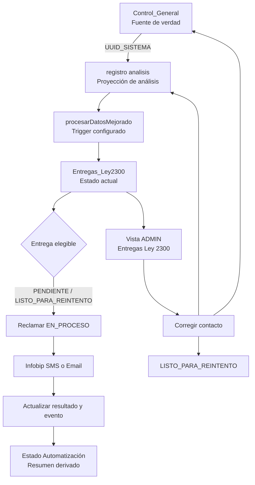
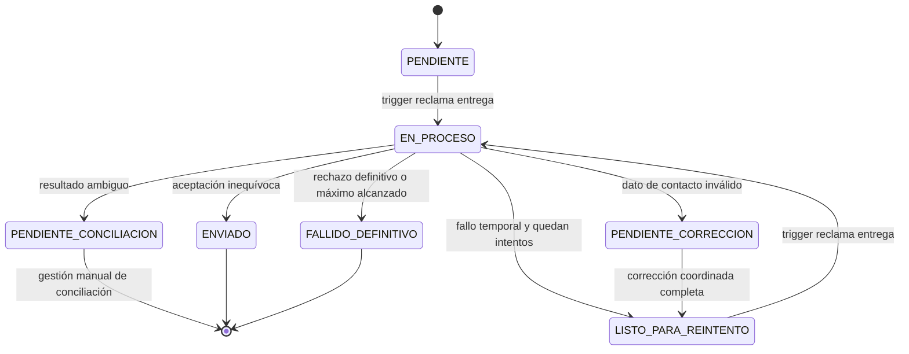

# Design Document — Gestión de entregas Ley 2300

## Overview

La solución sustituye el control de envío basado únicamente en el texto de `Estado Automatización` por una entidad durable de entrega. Cada comunicación se identifica por `UUID_SISTEMA`, participante y canal; así, una corrección reabre solo el contacto fallido y no reenvía comunicaciones previamente aceptadas por Infobip.

`Control_General` se mantiene como fuente de verdad de los contactos. `registro analisis` continúa como proyección consumida por el flujo de análisis. La corrección ADMIN escribe ambos libros por `UUID_SISTEMA` dentro de una operación coordinada y solo habilita el reintento si ambas escrituras terminaron correctamente.

La política `cumplimiento_ley_2300` y su trigger existente siguen gobernando todas las ejecuciones. El valor `cadaDias` configurado determina la frecuencia efectiva; no se crea un trigger paralelo ni se conserva una regla interna de 15 días.

## Decisiones de diseño

- Se conserva la política vigente de canal: por participante se prioriza email cuando existe; SMS aplica cuando no hay email utilizable. Cambiar a ambos canales requiere una definición de negocio y consentimiento explícitos, por lo que queda fuera de este alcance.
- Una aceptación HTTP 200/201 de Infobip se registra como `ENVIADO` en el sentido operativo de aceptación por proveedor, no como confirmación de entrega final al destinatario.
- Un timeout, una excepción de red o una terminación de ejecución después de iniciar el envío se clasifica como `PENDIENTE_CONCILIACION`; nunca se reintenta automáticamente.
- Los destinos completos no se persisten en la nueva bitácora ni se incluyen en DTOs, eventos, CSV, logs o toasts. Se resuelven desde la fuente de verdad justo antes de enviar y se exponen enmascarados.
- Las marcas históricas no se reinterpretan como evidencia individual. Las filas `Parcial` migran a revisión sin reintento automático; las filas `Procesado` quedan excluidas de la migración de envíos.

## Architecture



## Persistence model

### `Entregas_Ley2300`

Una fila por clave de entrega actual. La hoja se crea de forma idempotente en el Libro de Control.

| Campo | Propósito |
|---|---|
| `ENTREGA_ID` | ID opaco y estable generado por sistema. |
| `CLAVE_ENTREGA` | `UUID_SISTEMA|PARTICIPANTE|CANAL`; única. |
| `UUID_SISTEMA`, `ID_LOTE`, `SOLICITUD` | Relación con la solicitud y navegación operativa. |
| `PARTICIPANTE`, `CANAL` | Valores allowlisted: INQ/COA1..COA5 y EMAIL/SMS. |
| `DESTINO_MASCARADO`, `HUELLA_DESTINO` | Visualización segura y detección de cambio sin conservar PII. |
| `ESTADO`, `CAUSA_FALLO`, `CODIGO_RESULTADO` | Estado y clasificación allowlisted. |
| `REFERENCIA_PROVEEDOR` | `messageId` cuando Infobip lo devuelve. |
| `INTENTOS`, `MAX_INTENTOS`, `PROXIMO_INTENTO_EN` | Política de reintento. |
| `INTENTO_ACTIVO_ID`, `EN_PROCESO_DESDE`, `VERSION` | Idempotencia y concurrencia. |
| `CREADA_EN`, `ACTUALIZADA_EN`, `ENVIADA_EN` | Auditoría operacional. |

### `Entregas_Ley2300_Eventos`

Historial append-only. Registra creación, reclamo, resultado, corrección, migración y conciliación. Solo contiene identificadores, máscaras, estados, actor pseudonimizado, códigos y detalles sanitizados.

### `Operaciones_Ley2300`

Bitácora de correcciones coordinadas entre los dos libros. Estados: `PREPARADA`, `CONTROL_APLICADO`, `ANALISIS_APLICADO`, `COMPLETA`, `PENDIENTE_CONCILIACION`. Compensa la ausencia de transacciones entre Google Sheets y evita habilitar reintentos ante actualización parcial.

## State machine



El trigger selecciona únicamente `PENDIENTE` y `LISTO_PARA_REINTENTO` cuya fecha de elegibilidad ya llegó. Nunca selecciona los demás estados.

## Orquestación del trigger

1. Verifica `NotificationConfig_estaActiva('cumplimiento_ley_2300')` y adquiere el `ScriptLock` existente.
2. Carga solicitudes aprobadas y crea, de forma idempotente, entregas faltantes para contactos aplicables.
3. Obtiene un lote acotado de entregas elegibles, valida estado y versión, las marca `EN_PROCESO`, incrementa el intento y registra evento antes de llamar a Infobip.
4. Ejecuta cada envío reutilizando los servicios de SMS/email, que retornarán resultado por entrega, `statusCode`, `messageId`, estado y causa sanitizada.
5. Reingresa al lock para finalizar individualmente cada entrega y derivar el resumen por solicitud en `Estado Automatización`.
6. Genera el reporte ADMIN después de persistir los resultados. Un fallo en el reporte no cambia ni reabre las entregas.
7. Si el circuit breaker se activa, las entregas no invocadas se mantienen elegibles sin consumir intento.

El envío no usa `retry()` genérico. El reintento HTTP 429 de email es un subintento del mismo intento lógico. El circuit breaker se aplicará solo con al menos cinco fallos consecutivos y el umbral porcentual configurado en constantes internas del dominio.

## Normalización y clasificación

- `normalizarCelularLey2300` aceptará solamente celulares colombianos de diez dígitos iniciados en `3`, o el formato nacional normalizado con `57`; retornará `573XXXXXXXXX` o inválido.
- `normalizarCorreoLey2300` recortará espacios y convertirá a minúscula para identidad técnica; la validación de formato se conserva en el servidor.
- Causas allowlisted: `DATOS_CONTACTO`, `TEMPORAL`, `CONFIGURACION`, `RECHAZO_DEFINITIVO`, `AMBIGUO`.
- Los servicios SMS/email devolverán una entrada por entrega, no solo contadores. Los contadores existentes se conservarán para reportes compatibles.

## Corrección ADMIN

La interfaz envía únicamente:

```javascript
{ entregaId: '...', versionEsperada: 3, contacto: '...' }
```

El backend resuelve de la entrega el UUID, participante, canal y columna permitida. Rechaza propiedades inesperadas, roles distintos de ADMIN, estado distinto de `PENDIENTE_CORRECCION`, versión obsoleta y formatos inválidos.

Secuencia coordinada:

1. Crea operación `PREPARADA` y obtiene el lock compartido.
2. Busca la fila de `Control_General` y `registro analisis` por `UUID_SISTEMA`.
3. Actualiza el campo derivado en `Control_General`; deja `CONTROL_APLICADO`.
4. Actualiza el campo homónimo en `registro analisis`; deja `ANALISIS_APLICADO`.
5. Verifica ambas actualizaciones, incrementa `VERSION`, registra evento, mueve únicamente la entrega a `LISTO_PARA_REINTENTO` y cierra como `COMPLETA`.
6. Ante cualquier fallo parcial, deja la operación y la entrega en conciliación, registra información sanitizada e informa un error genérico. No habilita reintento.

## RPC and UI

Se conserva el patrón de `google.script.run` y `callServer`, con endpoints delgados en `Api.js` y repositorio de dominio separado:

| RPC | Rol | Respuesta |
|---|---|---|
| `api_obtenerEntregasLey2300(filtros, pagina, porPagina)` | ADMIN | Lista paginada con DTO enmascarado. |
| `api_obtenerDetalleEntregaLey2300(entregaId)` | ADMIN | Estado, historial seguro y contexto de lote. |
| `api_corregirContactoLey2300(comando)` | ADMIN | `{ok, mensaje, entrega}`; no envía directamente. |
| `api_obtenerResumenEntregasLey2300()` | ADMIN | Contadores y próxima ejecución estimada. |

La vista `Entregas Ley 2300` será exclusiva de ADMIN, reutilizará el menú, esqueletos, navegación y cache en memoria existentes. Tendrá filtros de lote, solicitud, participante, canal, estado, causa y fecha. El detalle mostrará solo el destino enmascarado y la acción `Corregir contacto` cuando aplique. La operación de corrección no usará el reintento automático del cliente para evitar dobles escrituras por fallos ambiguos.

## Migration and retention

1. Bootstrap idempotente de las tres hojas.
2. Migración idempotente de solicitudes aprobadas sin marca a `PENDIENTE`.
3. Marcas históricas `Parcial` se registran como `PENDIENTE_CONCILIACION` con origen `MIGRACION`; no se reenvían.
4. Marcas `Procesado` no crean entregas nuevas ni se reinterpretan.
5. La retención de eventos y operaciones será de máximo 90 días; después se purgarán o anonimizarán, conservando solo métricas agregadas.

## Testing strategy

- Unitarias: normalización, enmascaramiento, claves de entrega, transición de estados, clasificación, validación del comando ADMIN e idempotencia.
- Integración simulada: bootstrap de hojas, creación por UUID, actualización coordinada de ambos libros, operación parcial, selección del trigger, transición por resultados SMS/email, reporte posterior a persistencia.
- Seguridad: rechazo de rol no ADMIN, claves inesperadas, PII en DTO/eventos y conflicto de versión.
- Transporte Infobip: 200/201, 429 con subintentos, rechazo, error temporal y excepción ambigua.
- Regresión: no duplicar envío tras segunda ejecución y no reabrir entregas `ENVIADO` o `PENDIENTE_CONCILIACION`.

## Rollout and rollback

La entrega se habilita en fases: bootstrap y lectura, migración sin reenvío, activación de nuevas entregas, luego UI ADMIN. Antes de activar el trigger modificado se validan los contadores frente al resumen previo. El rollback consiste en desactivar la política de Ley 2300 desde Configuración y conservar las nuevas hojas como evidencia; no se borran eventos ni se fuerzan reenvíos.
