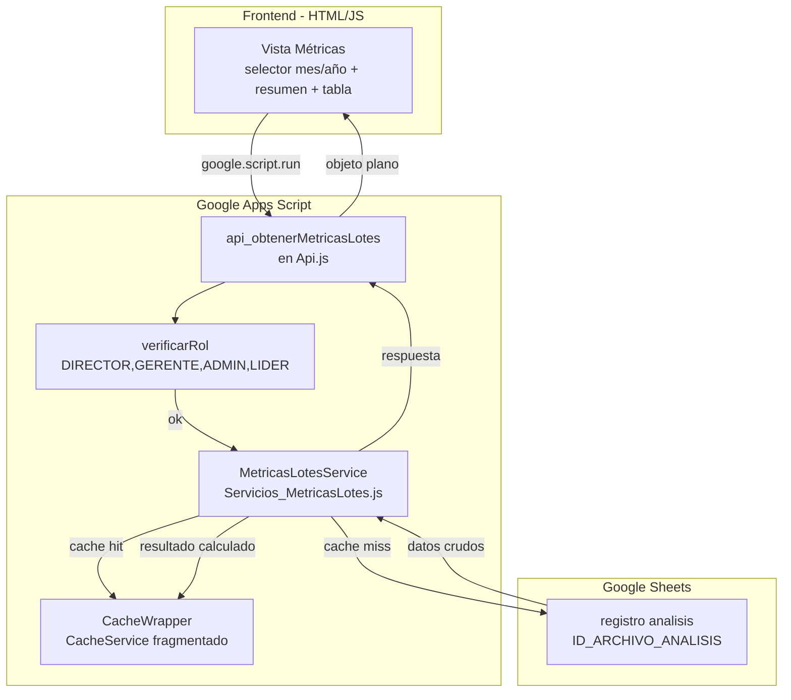

# Design Document: Métricas Operativas de Lotes

## Overview

Este módulo agrega un servicio de métricas operativas (`MetricasLotesService`) y una función API (`api_obtenerMetricasLotes`) que permite a los roles de liderazgo (DIRECTOR, GERENTE, ADMIN, LIDER) consultar un resumen mensual de aprobación/negación de lotes y solicitudes, junto con una tabla de seguimiento detallada por lote con desglose de estados combinados.

Los datos se leen exclusivamente de la hoja "registro analisis" del spreadsheet de análisis, utilizando las columnas: `Fecha Lote`, `Solicitud Inquilino`, `codigo lote`, `RESULTADO LOTE`, `RESULTADO SOLICITUD` y `REGISTRO ANALISTA SAI`.

El diseño sigue los patrones establecidos del proyecto:
- Función API delgada en `Api.js` (verificación de rol → delegación al servicio → retorno seguro)
- Servicio de dominio en un archivo dedicado (`Servicios_MetricasLotes.js`)
- Caché con `CacheWrapper_putJSON` / `CacheWrapper_getJSON` para minimizar lecturas a Sheets
- Frontend HTML con `google.script.run` para consumir la API

## Architecture



### Decisiones de Diseño

| Decisión | Justificación |
|----------|---------------|
| Un único endpoint `api_obtenerMetricasLotes(mes, anio)` | Minimiza llamadas frontend; el payload incluye resumen + detalle en una sola respuesta. Patrón consistente con `api_obtenerResumenDashboard`. |
| Servicio en archivo dedicado (`Servicios_MetricasLotes.js`) | Separa la lógica de dominio del layer API. El archivo de Api.js ya tiene 300+ líneas; mantenerlo delgado. |
| Cache key = `'METRICAS_LOTES_' + mes + '_' + anio` | Una entrada por periodo mensual. TTL 120s — suficiente para navegación rápida, lo bastante corto para reflejar datos frescos. |
| Lectura batch de headers + datos | Lee headers una vez (cached 300s) y luego un solo `getDataRange()` filtrado. Patrón idéntico al de `obtenerSolicitudesResumen`. |
| No se usa paginación servidor en la tabla de detalle | Un mes razonable tiene ~50-200 lotes; el payload no supera 100 KB típicamente. Si algún mes excede 100 KB, CacheWrapper fragmenta automáticamente. |
| Comparaciones case-insensitive + trim | Requerido explícitamente por los criterios de aceptación. Se aplica una vez al leer la fila, no en cada comparación. |

## Components and Interfaces

### 1. `api_obtenerMetricasLotes(mes, anio)` — Api.js

```javascript
/**
 * Retorna métricas operativas de lotes para un periodo mensual.
 * Expuesta vía google.script.run.
 * @param {number} mes - Entero 1-12
 * @param {number} anio - Entero de 4 dígitos (e.g. 2024)
 * @returns {{resumen: ResumenMetricas, detallePorLote: DetalleLote[]}}
 */
function api_obtenerMetricasLotes(mes, anio) {
  try {
    verificarRol(['DIRECTOR', 'GERENTE', 'ADMIN', 'LIDER']);
    return calcularMetricasLotes(mes, anio);
  } catch (e) {
    _registrarEvento_('ERROR', 'Api.js', 'api_obtenerMetricasLotes', e.message);
    return _metricasLotesVacias();
  }
}
```

### 2. `calcularMetricasLotes(mes, anio)` — Servicios_MetricasLotes.js

Función principal del servicio. Orquesta: validación de parámetros → cache lookup → lectura de datos → cálculo → cache store → retorno.

```javascript
/**
 * @param {number} mes - 1..12
 * @param {number} anio - e.g. 2025
 * @returns {{resumen: ResumenMetricas, detallePorLote: DetalleLote[]}}
 */
function calcularMetricasLotes(mes, anio) { /* ... */ }
```

### 3. `_metricasLotesVacias()` — Servicios_MetricasLotes.js

Safe-default para errores y parámetros inválidos.

```javascript
function _metricasLotesVacias() {
  return {
    resumen: {
      lotesAprobados: 0,
      lotesNegados: 0,
      solicitudesAprobadas: 0,
      solicitudesNegadas: 0,
      solicitudesReconsideradas: 0
    },
    detallePorLote: []
  };
}
```

### Interfaces (Tipos de Retorno)

```typescript
// ResumenMetricas
interface ResumenMetricas {
  lotesAprobados: number;          // Distinct codigo_lote con RESULTADO_LOTE="APROBADO"
  lotesNegados: number;            // Distinct codigo_lote con RESULTADO_LOTE="NEGADO"
  solicitudesAprobadas: number;    // REGISTRO_ANALISTA_SAI == "APROBADO" (excluye RECONSIDERADO)
  solicitudesNegadas: number;      // REGISTRO_ANALISTA_SAI == "NEGADO"
  solicitudesReconsideradas: number; // REGISTRO_ANALISTA_SAI contiene "RECONSIDERADO APROBADO"
}

// DetalleLote
interface DetalleLote {
  fechaLote: string;               // Formato "d/MM/yyyy"
  codigoLote: string;
  resultadoLote: string;           // "APROBADO" | "NEGADO" | ""
  cantidadSolicitudes: number;
  solicitudesAprobadasEnLote: number;
  solicitudesAprobadasIndividualNegadaPorLote: number;
  solicitudesNegadasIndividualAprobadasPorLote: number;
  solicitudesNegadas: number;
  aprobadaPorLoteNegadaPorAnalista: number;
  negadaPorLoteReconsideradaPorGerencia: number;
}
```

## Data Models

### Fuente de Datos: Hoja "registro analisis"

| Columna (header) | Uso en Métricas | Normalización |
|---|---|---|
| `Fecha Lote` | Filtro por periodo mensual | Convertir a Date; excluir si vacía o inválida |
| `codigo lote` | Agrupación de lotes; conteo de lotes distintos | `String().trim()` |
| `Solicitud Inquilino` | Identificador único de solicitud para conteo | `String().trim()` — conteo de valores únicos por lote |
| `RESULTADO LOTE` | Clasificación del lote (APROBADO/NEGADO) | `.trim().toUpperCase()` |
| `RESULTADO SOLICITUD` | Resultado individual de solicitud | `.trim().toUpperCase()` |
| `REGISTRO ANALISTA SAI` | Resultado del analista | `.trim().toUpperCase()` — comparación exacta + contains para "RECONSIDERADO" |

### Estructura de Caché

```
Key: "METRICAS_LOTES_{mes}_{anio}"
TTL: 120 segundos
Value: JSON serializado de {resumen, detallePorLote}

Key: "HDR_METRICAS_LOTES"
TTL: 300 segundos
Value: Array de headers de la hoja (para mapear columnas por nombre)
```

### Flujo de Datos (Pseudocódigo)

```
1. Validar mes (1-12), anio (4 dígitos) → si inválido, retornar safe-default
2. Construir cacheKey = "METRICAS_LOTES_" + mes + "_" + anio
3. Intentar CacheWrapper_getJSON(cacheKey) → si hit, retornar
4. Leer headers (con caché de 300s en HDR_METRICAS_LOTES)
5. Mapear índices de columnas necesarias
6. Leer datos completos de la hoja
7. Para cada fila:
   a. Parsear Fecha_Lote → si inválida, skip
   b. Verificar si pertenece al periodo → si no, skip
   c. Normalizar campos (trim + toUpperCase)
   d. Acumular en resumen y detalle por lote
8. Ordenar detallePorLote por Fecha_Lote descendente
9. Almacenar en caché con CacheWrapper_putJSON (TTL 120s)
10. Retornar resultado
```

## Correctness Properties

*A property is a characteristic or behavior that should hold true across all valid executions of a system — essentially, a formal statement about what the system should do. Properties serve as the bridge between human-readable specifications and machine-verifiable correctness guarantees.*

### Property 1: Conteo de lotes aprobados/negados es consistente con el detalle

*For any* periodo mensual válido y cualquier conjunto de datos en registro analisis, la suma de elementos en `detallePorLote` cuyo `resultadoLote` es "APROBADO" SHALL ser igual a `resumen.lotesAprobados`, y la suma de aquellos cuyo `resultadoLote` es "NEGADO" SHALL ser igual a `resumen.lotesNegados`.

**Validates: Requirements 1.1, 1.2, 2.1**

### Property 2: Exclusión de filas sin Fecha_Lote válida

*For any* conjunto de datos que contenga filas con Fecha_Lote vacía o no interpretable como fecha, dichas filas SHALL ser excluidas de todos los conteos (resumen y detalle), y el sistema no SHALL generar error.

**Validates: Requirements 1.6, 3.5**

### Property 3: Clasificación de REGISTRO_ANALISTA_SAI es mutuamente excluyente

*For any* solicitud dentro de un periodo, si REGISTRO_ANALISTA_SAI contiene "RECONSIDERADO APROBADO" entonces SHALL contar solo como reconsiderada y no como aprobada exacta; si es exactamente "APROBADO" SHALL contar solo como aprobada; si es exactamente "NEGADO" SHALL contar solo como negada.

**Validates: Requirements 1.3, 1.4, 1.7**

### Property 4: La suma de métricas por solicitud dentro de un lote no excede la cantidad de solicitudes

*For any* lote en `detallePorLote`, la suma de `solicitudesAprobadasEnLote` + `solicitudesAprobadasIndividualNegadaPorLote` + `solicitudesNegadasIndividualAprobadasPorLote` + `solicitudesNegadas` + `aprobadaPorLoteNegadaPorAnalista` + `negadaPorLoteReconsideradaPorGerencia` SHALL ser menor o igual a `cantidadSolicitudes`.

**Validates: Requirements 2.2, 2.3, 2.4, 2.5, 2.6, 2.7, 2.8, 2.10**

### Property 5: Normalización case-insensitive produce resultados idénticos

*For any* conjunto de datos donde los campos de texto contienen variaciones de case (e.g., "aprobado", "Aprobado", "APROBADO") y/o espacios extra al inicio/final, el resultado de `calcularMetricasLotes` SHALL ser idéntico al resultado calculado sobre esos mismos datos con todos los campos pre-normalizados a uppercase sin espacios.

**Validates: Requirements 1.1, 1.2, 1.3, 1.4, 2.1**

### Property 6: Parámetros inválidos retornan safe-default

*For any* valor de `mes` fuera del rango 1-12 o `anio` que no sea un entero de 4 dígitos, `calcularMetricasLotes` SHALL retornar el objeto safe-default (`_metricasLotesVacias()`) sin leer del Registro_Analisis.

**Validates: Requirements 6.4**

### Property 7: Filtrado por periodo mensual es correcto (inclusión/exclusión por rango)

*For any* fecha de lote, dicha fila SHALL incluirse en los cálculos si y solo si la fecha es >= primer día del mes seleccionado (00:00:00) y <= último día del mes seleccionado (23:59:59), sin considerar componente horario en la comparación.

**Validates: Requirements 3.3**

## Error Handling

| Escenario | Comportamiento |
|-----------|---------------|
| Usuario sin rol permitido | `verificarRol` lanza excepción → `api_obtenerMetricasLotes` captura → retorna safe-default + registra evento ERROR |
| Parámetros `mes`/`anio` inválidos | Validación temprana en `calcularMetricasLotes` → retorna safe-default sin acceder a Sheets |
| Hoja "registro analisis" no encontrada | Retorna safe-default + registra evento ERROR |
| Columna requerida no encontrada en headers | Retorna safe-default + registra evento ERROR con nombre de columna faltante |
| Fila con Fecha_Lote vacía o inválida | Se excluye silenciosamente del cálculo (sin error) |
| Fila con RESULTADO_LOTE/SOLICITUD/SAI vacío | Se excluye de las métricas combinadas pero se cuenta en `cantidadSolicitudes` |
| CacheService no disponible | Se calcula directamente desde Sheets y se retorna sin cachear (degradación elegante) |
| Payload > 500 KB | Se retorna sin cachear + se registra WARN vía `_registrarEvento_` |
| Error inesperado durante cálculo | Se captura en `api_obtenerMetricasLotes` → retorna safe-default + registra ERROR |

## Testing Strategy

### Enfoque Dual: Unit Tests + Property Tests

**Unit Tests (example-based):**
- Verificar que `api_obtenerMetricasLotes` rechaza roles no autorizados
- Verificar respuesta safe-default ante parámetros inválidos
- Verificar que el selector de periodo frontend carga con mes/año actual por defecto
- Verificar formato de respuesta (propiedades correctas, tipos correctos)
- Verificar comportamiento cuando CacheService no está disponible

**Property Tests (property-based con fast-check o similar):**
- Implementar las 7 propiedades de correctness definidas arriba
- Generar datos aleatorios de registro analisis con variaciones de case, espacios, fechas dentro/fuera del periodo
- Cada test ejecuta mínimo 100 iteraciones
- Tag format: `Feature: metricas-operativas-lotes, Property {N}: {text}`

**Librería de Property Testing:** `fast-check` (ya disponible en el ecosistema Node.js del proyecto para los tests existentes con Jest/Vitest).

**Configuración:**
- Mínimo 100 iteraciones por propiedad
- Generadores customizados para:
  - Filas de registro analisis (con valores válidos e inválidos)
  - Periodos mensuales (mes 1-12, año 2024-actual)
  - Variaciones de case y whitespace

**Integration Tests:**
- Verificar que la función se despliega correctamente en el entorno GAS
- Verificar que la respuesta es serializable por `google.script.run`
- Verificar que la caché se invalida/expira correctamente
