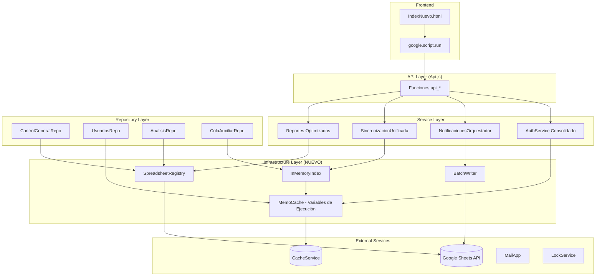
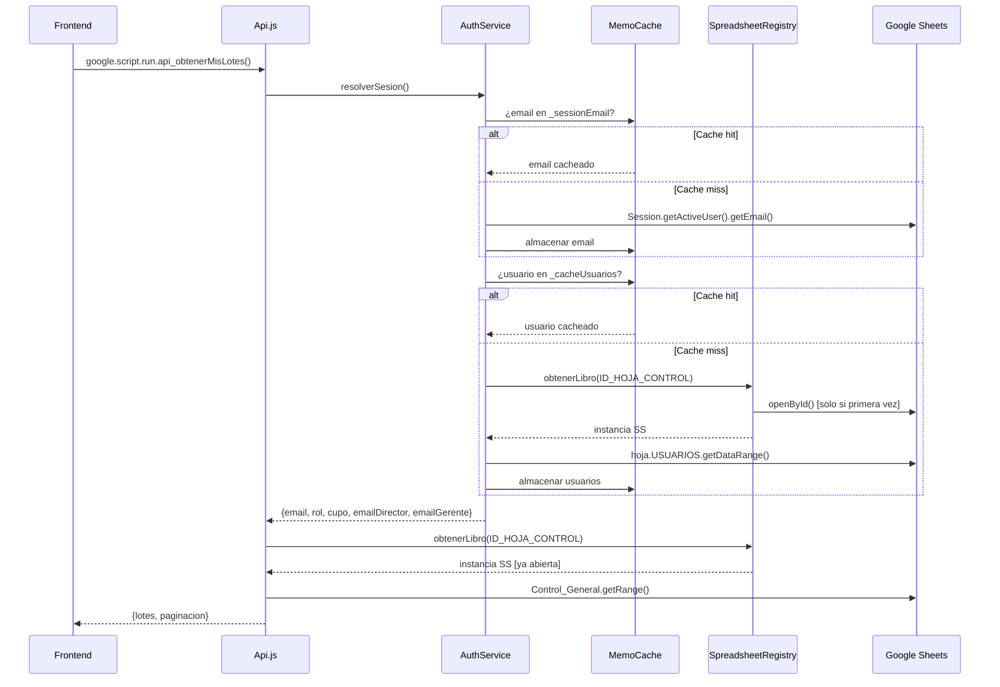

# Design Document: Optimización y Consolidación de Funciones

## Overview

Este diseño describe la refactorización del proyecto **automatizacion-inducciones** (Google Apps Script) para reducir latencia, eliminar redundancias y consolidar funciones que realizan operaciones similares. El enfoque principal es minimizar las llamadas a la API de Google Sheets (cada una agrega ~200-800ms de latencia de red) mediante tres estrategias:

1. **Registro centralizado de instancias** — Cada libro de cálculo se abre una sola vez por ejecución.
2. **Memoización en variables de ejecución** — Datos leídos se cachean en memoria durante la vida del script.
3. **Batching de escrituras** — Múltiples escrituras individuales se agrupan en bloques contiguos.

El resultado esperado es una reducción del 40-60% en llamadas a Sheets por request y la eliminación de ~15 funciones duplicadas/obsoletas.

## Architecture

### Diagrama de Arquitectura de Alto Nivel



### Diagrama de Flujo de Datos — Request Típico (api_obtenerMisLotes)



## Components and Interfaces

### 1. SpreadsheetRegistry (Infraestructura — NUEVO)

Registro global que garantiza una sola apertura por ID de libro por ejecución.

```javascript
/**
 * Registro centralizado de instancias de Spreadsheet abiertas.
 * Almacena como máximo 2 instancias (ID_HOJA_CONTROL, ID_ARCHIVO_ANALISIS).
 * Se limpia automáticamente al terminar la ejecución (isolate V8).
 */

/** @type {Object<string, GoogleAppsScript.Spreadsheet.Spreadsheet>} */
var _spreadsheetRegistry = {};

/**
 * Obtiene una instancia de Spreadsheet, abriendo el libro solo si no está
 * en el registro. Si openById lanza excepción, la propaga sin almacenar null.
 *
 * @param {string} spreadsheetId — ID del libro de cálculo
 * @returns {GoogleAppsScript.Spreadsheet.Spreadsheet}
 * @throws {Error} Si openById falla (ID inválido, permisos insuficientes)
 * @sheets_read 0-1 (0 si ya abierto, 1 la primera vez)
 */
function SpreadsheetRegistry_get(spreadsheetId) {}

/**
 * Verifica si un libro ya fue abierto en esta ejecución.
 * @param {string} spreadsheetId
 * @returns {boolean}
 */
function SpreadsheetRegistry_has(spreadsheetId) {}
```

### 2. MemoCache (Infraestructura — NUEVO)

Variables globales de ejecución para memoización de lecturas frecuentes.

```javascript
/** @type {string|null} Email de la sesión actual (se resuelve 1 vez) */
var _sessionEmail = null;

/** @type {Array|null} Datos completos de USUARIOS (leerTodos memoizado) */
var _cacheUsuariosTodos = null;

/** @type {Object|null} Mapa uuid → filaNum de Control_General */
var _indiceUuidFila = null;

/** @type {Object|null} Mapa idLote → [filaNum] de Control_General */
var _indiceLoteFila = null;

/**
 * Obtiene el email de la sesión activa (memoizado).
 * @returns {string} Email normalizado a minúsculas
 */
function MemoCache_getSessionEmail() {}

/**
 * Obtiene todos los usuarios (memoizado). Lee USUARIOS una sola vez.
 * @returns {UsuarioRecord[]}
 */
function MemoCache_getUsuarios() {}

/**
 * Obtiene o construye el índice UUID → filaNum desde los datos de Control_General.
 * @param {Array} datosControlGeneral — Datos ya leídos de CG (si disponibles)
 * @returns {Object<string, number>}
 */
function MemoCache_getIndiceUuid(datosControlGeneral) {}

/**
 * Obtiene o construye el índice idLote → [filaNum].
 * @param {Array} datosControlGeneral
 * @returns {Object<string, number[]>}
 */
function MemoCache_getIndiceLote(datosControlGeneral) {}
```

### 3. BatchWriter (Infraestructura — NUEVO)

Utilidad para agrupar escrituras en bloques contiguos.

```javascript
/**
 * Agrupa un conjunto de {fila, columna, valor} en bloques contiguos
 * y ejecuta un setValues() por bloque.
 *
 * @param {GoogleAppsScript.Spreadsheet.Sheet} hoja
 * @param {Array<{fila: number, columna: number, valor: any}>} operaciones
 * @returns {number} Cantidad de llamadas setValues ejecutadas
 */
function BatchWriter_escribir(hoja, operaciones) {}

/**
 * Agrupa un array de números de fila en bloques de filas contiguas.
 * Retorna un array de {inicio, cantidad} donde inicio es la primera fila
 * del bloque y cantidad es cuántas filas consecutivas hay.
 *
 * @param {number[]} filas — Array de números de fila (no necesariamente ordenados)
 * @returns {Array<{inicio: number, cantidad: number}>}
 */
function BatchWriter_agruparFilasContiguas(filas) {}
```

### 4. AuthService Consolidado (Refactorización)

Punto único de entrada para autenticación y resolución de usuario.

```javascript
/**
 * Punto único de entrada de autenticación. Resuelve toda la información
 * del usuario en una sola operación (CacheService → Sheets como fallback).
 *
 * @returns {{autorizado: boolean, email: string, rol?: string, cupo?: number,
 *            emailDirector?: string, emailGerente?: string}}
 * @sheets_read 0-1 (0 en cache-hit de CacheService, 1 en cache-miss)
 */
function resolverSesion() {}

/**
 * Verifica que el usuario actual tenga uno de los roles permitidos.
 * Reutiliza resultado de resolverSesion() si ya fue llamado en esta ejecución.
 *
 * @param {string[]} rolesPermitidos
 * @returns {{email: string, rol: string, cupo: number, emailDirector: string, emailGerente: string}}
 * @throws {Error} NO_AUTORIZADO | SIN_PERMISOS
 * @sheets_read 0 (reutiliza sesión ya resuelta)
 */
function verificarRol(rolesPermitidos) {}

/**
 * Retorna emails del equipo visible para el usuario ya autenticado.
 * Si verificarRol fue llamado previamente, reutiliza el usuario resuelto.
 * Si no, resuelve como fallback sin lanzar excepción.
 *
 * @param {string} email
 * @returns {string[]|null} null = acceso total (ADMIN/ASESOR)
 * @sheets_read 0-1
 */
function getEmailsEquipoVisible(email) {}

/**
 * Función canónica: retorna emails de usuarios activos con rol DIRECTOR, GERENTE o ADMIN.
 * Reemplaza: obtenerCorreosLideres (Codigo.js), obtenerCorreosLideres (AuthService),
 *            obtenerCorreosSuperiores (AuthService), UsuariosRepo_getCorreosSuperiores.
 *
 * @returns {string[]}
 * @sheets_read 0 (usa MemoCache_getUsuarios)
 */
function obtenerCorreosSuperiores() {}
```

### 5. Función Canónica de Resolución de Nombre (Consolidación)

```javascript
/**
 * Convierte un email a nombre derivado de la parte local.
 * Reemplaza: _correoANombre, _correoANombreCompleto, obtenerNombreDeComercial,
 *            obtenerNombreCompletoDeComercial, _derivarNombreDeEmail,
 *            _nombreComercialParaBusqueda.
 *
 * @param {string} email — Email a convertir
 * @param {'COMPLETO'|'MAYUSCULAS'|'PRIMER_NOMBRE'} formato
 *   - COMPLETO: "Maria Garcia" (cada palabra capitalizada)
 *   - MAYUSCULAS: "MARIA GARCIA"
 *   - PRIMER_NOMBRE: "Maria" (solo primera palabra capitalizada)
 * @returns {string} Nombre derivado, o "" si email es inválido
 */
function emailANombre(email, formato) {}
```

### 6. Orquestador de Notificaciones (Consolidación)

```javascript
/**
 * Orquestador diario de recordatorios. Lee Hoja_Control y Control_General
 * una sola vez y procesa secuencialmente recordatorios de paz y salvo y
 * de error en terceros.
 *
 * @sheets_read 2 (Hoja_Control + Control_General, una vez cada una)
 * @sheets_write 1 por bloque contiguo de filas actualizadas
 */
function ejecutarRecordatoriosDiarios() {}

/**
 * Resuelve el email del comercial por ID de lote desde un mapa pre-cargado.
 * @param {Object<string, string>} mapaLoteEmail — Mapa idLote → email
 * @param {string} idLote
 * @returns {string|null} Email o null si no encontrado/inválido
 */
function resolverEmailPorLote(mapaLoteEmail, idLote) {}

/**
 * Determina el nivel de escalamiento basado en días transcurridos.
 * @param {number} diasTranscurridos — Días desde último aviso o ingreso
 * @returns {{nivel: string, emoji: string, mensajeExtra: string}}
 *   nivel: "recordatorio" | "elevado" | "urgente" | "critico"
 */
function calcularEscalamiento(diasTranscurridos) {}
```

### 7. Sincronización Unificada (Consolidación)

```javascript
/**
 * Función unificada de sincronización. Reemplaza sincronizarLoteAutomatico
 * y sincronizarEstadoDesdeAnalisis en un solo trigger cada 10 minutos.
 *
 * Lee registro analisis y Control_General una sola vez cada una.
 * Usa LockService con timeout de 30s para evitar conflictos con
 * procesarDatosMejorado().
 *
 * @sheets_read 2 (Control_General + registro analisis)
 * @sheets_write N (un setValues por bloque contiguo de filas modificadas)
 */
function sincronizarUnificado() {}
```

### 8. Métricas con Cache-First (Optimización)

```javascript
/**
 * Obtiene métricas de lotes con estrategia cache-first.
 * Clave de cache: METRICAS_LOTES_{fechaDesde}_{fechaHasta}
 *
 * @param {string} fechaDesde — YYYY-MM-DD
 * @param {string} fechaHasta — YYYY-MM-DD (máximo 183 días desde fechaDesde)
 * @returns {Object} Métricas calculadas
 * @sheets_read 0 en cache-hit, 1-2 en cache-miss
 */
function api_obtenerMetricasLotes(fechaDesde, fechaHasta) {}

/**
 * Obtiene tendencias históricas de N meses. Lee registro analisis una sola vez
 * y filtra en memoria por cada mes.
 *
 * @param {number} cantidadMeses — 1 a 12
 * @returns {Object} Tendencias por mes
 * @sheets_read 0 en cache-hit, 1 en cache-miss
 */
function api_obtenerMetricasLotesHistorico(cantidadMeses) {}
```

## Data Models

### UsuarioRecord (sin cambios)

```javascript
/**
 * @typedef {Object} UsuarioRecord
 * @property {string} email          — Email primario (normalizado minúsculas)
 * @property {string} rol            — CONSULTOR|ANALISTA|AUXILIAR|DIRECTOR|GERENTE|ADMIN|ASESOR
 * @property {boolean} activo        — Estado activo
 * @property {number} cupo           — Cupo máximo de solicitudes
 * @property {string} emailDirector  — Email del director supervisor
 * @property {string} emailGerente   — Email del gerente supervisor
 * @property {string[]} emailsAlternos — Emails alternos del usuario
 */
```

### SesionResuelta (NUEVO)

```javascript
/**
 * @typedef {Object} SesionResuelta
 * @property {boolean} autorizado
 * @property {string} email
 * @property {string} [rol]
 * @property {number} [cupo]
 * @property {string} [emailDirector]
 * @property {string} [emailGerente]
 */
```

### EscalamientoResult (NUEVO)

```javascript
/**
 * @typedef {Object} EscalamientoResult
 * @property {string} nivel           — "recordatorio"|"elevado"|"urgente"|"critico"
 * @property {string} emoji           — Emoji para el asunto del correo
 * @property {string} mensajeExtra    — HTML adicional según umbral alcanzado
 */
```

### BloqueContiguo (NUEVO)

```javascript
/**
 * @typedef {Object} BloqueContiguo
 * @property {number} inicio    — Primera fila del bloque (1-based)
 * @property {number} cantidad  — Número de filas consecutivas
 */
```

### ResultadoOperacion (existente, sin cambios)

```javascript
/**
 * @typedef {Object} ResultadoOperacion
 * @property {boolean} ok       — true si la operación fue exitosa
 * @property {string} mensaje   — Descripción del resultado
 */
```

## Correctness Properties

*A property is a characteristic or behavior that should hold true across all valid executions of a system — essentially, a formal statement about what the system should do. Properties serve as the bridge between human-readable specifications and machine-verifiable correctness guarantees.*

### Property 1: SpreadsheetRegistry abre cada ID una sola vez por ejecución

*For any* sequence of N calls to `SpreadsheetRegistry_get(id)` with the same `id` within a single script execution, `SpreadsheetApp.openById(id)` should be invoked exactly once, and all N calls should return the same instance object.

**Validates: Requirements 1.1, 1.2, 1.3, 1.4, 4.1, 4.2**

### Property 2: UsuariosRepo memoización (lectura única por ejecución)

*For any* number of invocations N ≥ 1 of `MemoCache_getUsuarios()` within a single script execution, the underlying sheet read (`getDataRange()` on USUARIOS) should be invoked exactly once, and all invocations should return arrays with identical content.

**Validates: Requirements 2.2, 2.3**

### Property 3: Sesión resuelta una sola vez por ejecución

*For any* number of calls to funciones de autenticación (resolverSesion, verificarRol, getEmailsEquipoVisible) within a single script execution, `Session.getActiveUser().getEmail()` should be invoked exactly once.

**Validates: Requirements 9.1, 9.2**

### Property 4: Índice en memoria produce mapeo correcto UUID/LoteId → fila

*For any* dataset de Control_General con N filas, donde la columna BJ contiene UUIDs y la columna A contiene IDs de lote, el índice construido por `MemoCache_getIndiceUuid(datos)` debe mapear cada UUID no vacío a su número de fila correcto (fila 1-based = índice + 2, considerando encabezados), y `MemoCache_getIndiceLote(datos)` debe mapear cada ID de lote a todos los números de fila que lo contienen.

**Validates: Requirements 10.1, 10.3, 10.5**

### Property 5: Agrupación en bloques contiguos produce el mínimo de escrituras

*For any* conjunto de números de fila (o columna) no vacío, `BatchWriter_agruparFilasContiguas(filas)` debe retornar exactamente K bloques donde K es el número de secuencias máximas de enteros consecutivos en el conjunto ordenado. La suma de las cantidades de todos los bloques debe igualar la cantidad total de filas de entrada.

**Validates: Requirements 5.1, 5.3, 5.4**

### Property 6: Conversión email-a-nombre canónica

*For any* string `email` que contiene exactamente un carácter "@" y cuya parte local (antes de @) contiene al menos un carácter no-punto, `emailANombre(email, formato)` debe: (a) para formato COMPLETO retornar cada segmento separado por punto con inicial mayúscula y resto minúscula, unidos por espacio; (b) para formato MAYUSCULAS retornar lo mismo pero todo en mayúsculas; (c) para formato PRIMER_NOMBRE retornar solo el primer segmento capitalizado. Para cualquier input nulo, vacío, no-string, o sin "@", debe retornar cadena vacía.

**Validates: Requirements 6.1, 6.4, 6.5**

### Property 7: Escalamiento progresivo determinista

*For any* entero no negativo `dias`, `calcularEscalamiento(dias)` debe retornar: nivel="critico" si dias ≥ 21, nivel="urgente" si 14 ≤ dias < 21, nivel="elevado" si 7 ≤ dias < 14, nivel="recordatorio" si 3 ≤ dias < 7. Los campos emoji y mensajeExtra deben corresponder al nivel retornado.

**Validates: Requirements 3.3**

### Property 8: Métricas cache-first (hit retorna cache, miss calcula y almacena)

*For any* rango de fechas válido (formato YYYY-MM-DD, diferencia ≤ 183 días), si CacheWrapper contiene datos para la clave `METRICAS_LOTES_{fechaDesde}_{fechaHasta}`, la función debe retornar esos datos sin invocar lecturas a Sheets. Si no hay cache-hit, debe calcular desde Sheets y almacenar el resultado en CacheWrapper con TTL 120 segundos, siempre que el payload serializado no exceda 512 KB.

**Validates: Requirements 12.1, 12.2**

### Property 9: Detección de conflicto concurrente en sincronización

*For any* registro cuyo estado en la hoja difiere del estado leído al inicio de la ejecución de la sincronización, la función unificada debe omitir la escritura de ese registro y registrar en Logs_Sistema un evento con el UUID, estado esperado y estado encontrado, sin abortar el procesamiento de los demás registros.

**Validates: Requirements 11.3**

### Property 10: Filtro canónico de correos superiores

*For any* conjunto de registros de usuario donde algunos tienen rol DIRECTOR, GERENTE o ADMIN y campo activo=true, `obtenerCorreosSuperiores()` debe retornar exactamente los emails de los registros activos con dichos roles, sin duplicados y sin incluir usuarios inactivos o con otros roles.

**Validates: Requirements 2.4**

## Error Handling

### Estrategia General

| Escenario | Acción | Nivel Log |
|-----------|--------|-----------|
| openById falla (ID inválido/permisos) | Propagar excepción al caller sin almacenar null en registry | ERROR |
| Pestaña USUARIOS vacía o no encontrada | Retornar array vacío, registrar evento | WARN |
| CacheService no disponible | Degradación elegante: continuar sin cache | WARN |
| Email no encontrado por ID de lote | Omitir lote, registrar evento con ID | WARN |
| Cuota de email insuficiente | Abortar envío completo, registrar | WARN |
| Lock no adquirido en 30s | Abortar ejecución, delegar al próximo trigger | WARN |
| Conflicto de estado concurrente | Omitir registro específico, registrar | WARN |
| Fila no corresponde a UUID esperado | Abortar escritura, retornar {ok:false} | WARN |
| Payload de métricas > 512KB | No cachear, retornar resultado sin cache | INFO |
| Hoja Historico_Envios no existe | Retornar valores en cero para esa sección | INFO |

### Principios de Error Handling

1. **Nunca interrumpir procesamiento batch por error en un registro individual** — Continuar con los restantes y registrar los fallidos.
2. **Degradación elegante para CacheService** — Toda operación de cache está envuelta en try/catch que permite continuar sin cache.
3. **Propagación sin absorción** — Los errores de apertura de libros se propagan (indican problema de configuración), no se absorben silenciosamente.
4. **Idempotencia** — Operaciones de escritura verifican el estado actual antes de modificar (evitar doble-radicación, etc.).

## Testing Strategy

### Enfoque Dual: Unit Tests + Property-Based Tests

El proyecto utiliza **Vitest** como framework de testing (ya configurado en el proyecto).

#### Unit Tests (ejemplo-based)

- Verificar comportamiento específico de doGet con cache hit/miss
- Verificar que verificarRol lanza excepciones correctas para roles no autorizados
- Verificar formato de respuesta de funciones API
- Verificar edge cases: email null, pestaña inexistente, lock timeout
- Verificar configuración de triggers

#### Property-Based Tests (fast-check)

Se usará **fast-check** como librería de property-based testing con Vitest.

**Configuración:**
- Mínimo 100 iteraciones por propiedad
- Cada test referencia su propiedad del diseño con tag de comentario

**Propiedades a implementar:**

| # | Propiedad | Generador Principal |
|---|-----------|-------------------|
| 1 | SpreadsheetRegistry singleton | Secuencias aleatorias de IDs (2 posibles) × N llamadas |
| 2 | UsuariosRepo memoización | N > 1 invocaciones aleatorias |
| 3 | Sesión resuelta una vez | Secuencias aleatorias de llamadas a auth |
| 4 | Índice UUID/Lote correcto | Matrices de datos con UUIDs y loteIds generados |
| 5 | Bloques contiguos mínimos | Arrays de enteros positivos (filas) |
| 6 | emailANombre canónico | Emails generados (parte local con puntos) × 3 formatos |
| 7 | Escalamiento determinista | Enteros no negativos 0-365 |
| 8 | Cache-first métricas | Rangos de fecha válidos × estado de cache (hit/miss) |
| 9 | Detección conflicto concurrente | Registros con estados modificados vs no modificados |
| 10 | Filtro correos superiores | Conjuntos de UsuarioRecord con roles y estados variados |

**Tag format para cada test:**
```javascript
// Feature: optimizacion-consolidacion-funciones, Property 5: Batch grouping produces minimum setValues calls
```

### Integration Tests

- Verificar que los triggers configurados corresponden a las funciones correctas
- Verificar end-to-end del flujo de radicación con SpreadsheetRegistry
- Verificar sincronización unificada con datos reales en ambiente de desarrollo

### Estructura de archivos de test

```
tests/
├── unit/
│   ├── spreadsheet-registry.test.js
│   ├── memo-cache.test.js
│   ├── batch-writer.test.js
│   ├── email-a-nombre.test.js
│   ├── escalamiento.test.js
│   ├── auth-consolidado.test.js
│   └── metricas-cache.test.js
├── property/
│   ├── registry-singleton.prop.js
│   ├── memo-cache.prop.js
│   ├── session-once.prop.js
│   ├── indice-memoria.prop.js
│   ├── bloques-contiguos.prop.js
│   ├── email-nombre.prop.js
│   ├── escalamiento.prop.js
│   ├── cache-first.prop.js
│   ├── conflicto-sync.prop.js
│   └── correos-superiores.prop.js
└── integration/
    └── sincronizacion-unificada.test.js
```
