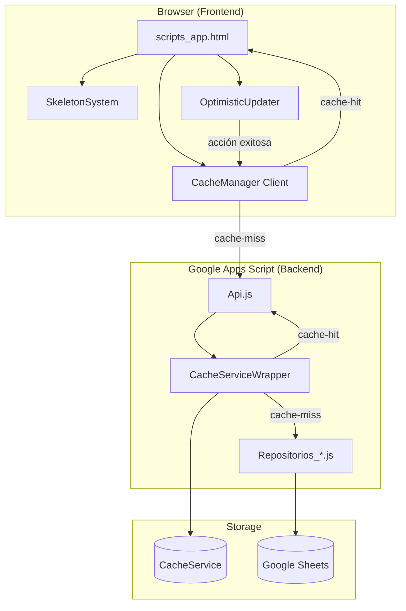
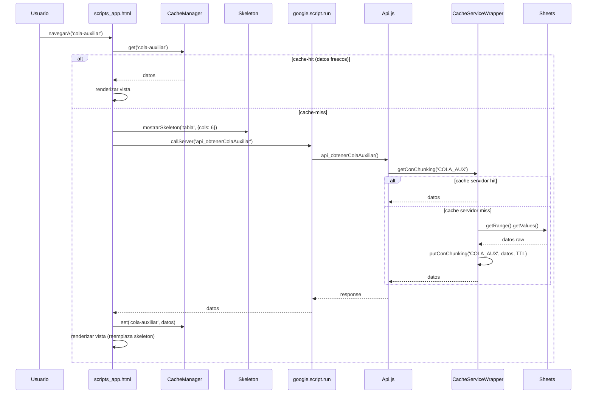
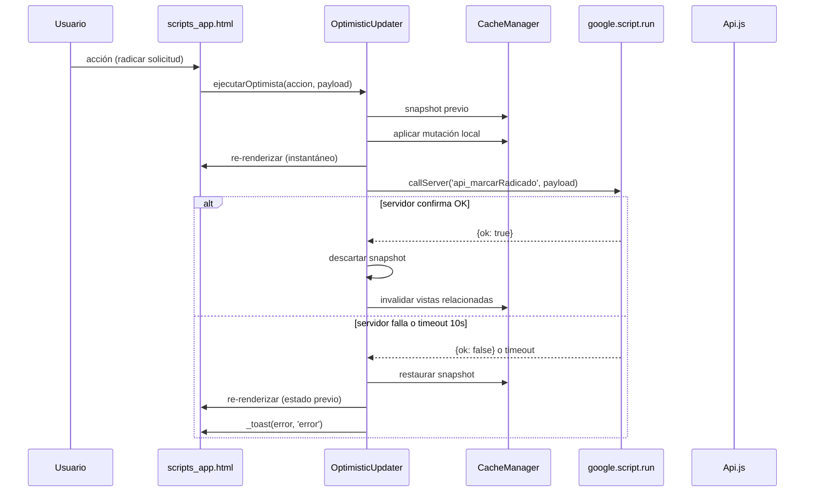
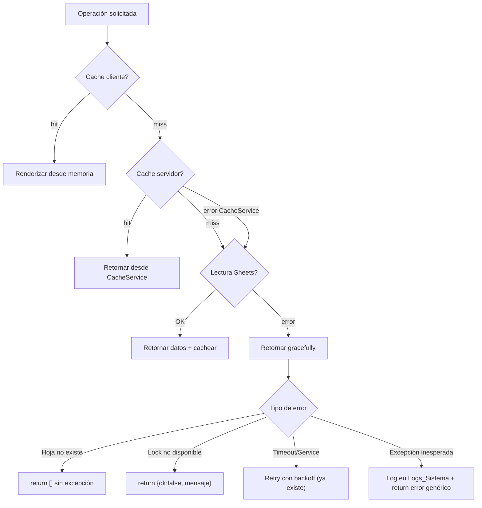

# Documento de Diseño — Optimización de Latencia y UX

## Overview

Este diseño aborda la optimización de latencia percibida y experiencia de usuario en la Web App v2 del sistema de Automatización de Inducciones (El Libertador). Las auditorías `docs/08-auditoria-rendimiento-vistas.md` y `docs/auditoria-tecnica-20260729.md` identificaron cuellos de botella específicos que este diseño resuelve de manera estructural.

**Objetivo principal**: Reducir el tiempo percibido de carga de las vistas de mayor uso diario (Cola auxiliar, Mis solicitudes analista, Pendientes comercial, Asignaciones líder) de 1-5 segundos a menos de 200 ms en re-visitas, y eliminar bloqueos de TTFB en la carga inicial.

**Restricciones técnicas del entorno GAS**:
- Tiempo máximo de ejecución: 6 minutos por invocación
- `CacheService`: 100 KB por clave, 25 MB total, TTL máximo 21600s
- `google.script.run`: asíncrono pero single-threaded en el cliente
- Sin bundlers/npm — JS plano servido vía `HtmlService`
- Llamadas a Sheets API son la fuente principal de latencia (~200-500 ms cada una)

**Estrategia general**: Aplicar tres capas de caché (servidor → cliente → optimista) y reducir las llamadas a Sheets a un mínimo teórico por vista, usando patrones que ya existen parcialmente en el proyecto (`obtenerDetalleSolicitud` como referencia gold-standard).

---

## Architecture

### Diagrama de alto nivel



### Flujo de datos por vista (patrón unificado)



### Flujo de actualización optimista



---

## Components and Interfaces

### 1. CacheManager (Cliente — `scripts_app.html`)

Reemplaza las variables sueltas actuales (`_colaAuxiliarCache`, `_cacheLocal`, `_todosLosLotes`) con un sistema unificado.

```javascript
/**
 * CacheManager — Almacén en memoria de sesión con invalidación selectiva.
 * Persiste SOLO durante la sesión del navegador (no usa localStorage).
 */
var CacheManager = {
  _store: {},      // { key: { data, timestamp } }
  _ttls: {         // TTL por vista (ms)
    'dashboard': 30000,
    'cola-auxiliar': 0,     // sin TTL, se invalida por acción
    'mis-solicitudes': 0,
    'asignaciones': 0,
    'errores': 0,
    'lotes': 0,
    'solicitudes': 0,
    'usuarios': 0,
    'config-motivos': 0
  },

  /**
   * @param {string} key — Identificador de la vista/dataset
   * @returns {*|null} — Datos o null si no hay cache válido
   */
  get: function(key) { /* ... */ },

  /**
   * @param {string} key
   * @param {*} data
   */
  set: function(key, data) { /* ... */ },

  /**
   * Invalida una o más claves.
   * @param {string|string[]} keys
   */
  invalidar: function(keys) { /* ... */ },

  /**
   * Invalida todo el store.
   */
  invalidarTodo: function() { /* ... */ },

  /**
   * Verifica si una clave tiene datos válidos.
   * TTL=0 significa que nunca expira por tiempo (solo por invalidación explícita).
   */
  esValido: function(key) { /* ... */ }
};
```

**Reglas de invalidación**:
| Acción del usuario | Claves a invalidar |
|---|---|
| Radicar solicitud | `cola-auxiliar`, `dashboard` |
| Marcar error | `cola-auxiliar`, `dashboard` |
| Enviar corrección | `errores`, `dashboard` |
| Pedir solicitud (analista) | `mis-solicitudes`, `asignaciones` |
| Guardar/eliminar usuario | `usuarios` |
| Guardar/eliminar motivo | `config-motivos`, `errores` |
| Reasignar solicitud | `asignaciones`, `mis-solicitudes` |

### 2. CacheServiceWrapper (Servidor — nuevo archivo `Servicios_CacheWrapper.js`)

Capa sobre `CacheService` que maneja fragmentación automática para payloads >100 KB y provee una API unificada.

```javascript
/**
 * CacheServiceWrapper — Caché servidor con fragmentación automática.
 *
 * Interfaz:
 *   getJSON(key): Object|null
 *   putJSON(key, obj, ttl): void
 *   remove(key): void
 *
 * Reglas:
 *   - Si el JSON < 99 KB → 1 clave directa
 *   - Si el JSON 99-500 KB → fragmentar en claves `key_PART_01`, `key_PART_02`...
 *   - Si el JSON > 500 KB → no cachear, log WARN
 *   - Cada fragmento almacena: header con total de partes
 */
```

**Estrategia de fragmentación**:
```
key → { _parts: N }                  (metadata, <1 KB)
key_PART_01 → chunk 1 (max 99 KB)
key_PART_02 → chunk 2 (max 99 KB)
...
key_PART_NN → chunk N
```

**Tabla de claves de caché servidor**:
| Clave | Contenido | TTL | Tamaño esperado |
|---|---|---|---|
| `HDR_REG_ANALISIS` | Headers de "registro analisis" | 300s | ~5 KB |
| `HDR_CONTROL_GENERAL` | Headers de Control_General | 300s | ~3 KB |
| `RESUMEN_GLOBAL` | KPIs dashboard (todos) | 60s | ~1 KB |
| `RESUMEN_{email}` | KPIs dashboard (comercial) | 60s | ~1 KB |
| `LOTES_GLOBAL` | Todos los lotes (líder) | 60s | 50-200 KB (fragmentable) |
| `LOTES_{email}` | Lotes del comercial | 60s | 5-30 KB |
| `CATALOGO_MOTIVOS` | Motivos de error | 600s | ~2 KB |

### 3. SkeletonSystem (Cliente — `scripts_app.html`)

Sistema declarativo de skeletons que genera HTML apropiado según el tipo de vista.

```javascript
/**
 * SkeletonSystem — Genera skeletons apropiados por tipo de contenido.
 *
 * Tipos:
 *   'tabla'      → thead real + N filas animadas
 *   'dashboard'  → cards KPI + barra de distribución placeholder
 *   'detalle'    → formulario con campos placeholder
 *   'lista'      → N cards placeholder
 */
var SkeletonSystem = {
  /**
   * Genera y renderiza un skeleton en el contenedor dado.
   * @param {string} containerId — ID del div contenedor
   * @param {string} tipo — 'tabla' | 'dashboard' | 'lista' | 'detalle'
   * @param {Object} opciones — { columnas: string[], filas: number, titulo: string }
   */
  mostrar: function(containerId, tipo, opciones) { /* ... */ },

  /**
   * Transiciona suavemente del skeleton al contenido real.
   * @param {string} containerId
   * @param {string} htmlContenido
   */
  reemplazar: function(containerId, htmlContenido) { /* ... */ }
};
```

### 4. OptimisticUpdater (Cliente — `scripts_app.html`)

Maneja el patrón de actualización optimista con rollback automático.

```javascript
/**
 * OptimisticUpdater — Ejecuta acciones con UI instantánea y rollback en fallo.
 *
 * Patrón:
 *   1. Guardar snapshot del estado en CacheManager
 *   2. Aplicar mutación local (optimista)
 *   3. Re-renderizar UI (instantáneo)
 *   4. Ejecutar callServer en background
 *   5a. Si OK → descartar snapshot, invalidar vistas relacionadas
 *   5b. Si FAIL/Timeout → restaurar snapshot, re-renderizar, toast error
 */
var OptimisticUpdater = {
  /**
   * @param {Object} config
   * @param {string} config.cacheKey — Clave del CacheManager a mutar
   * @param {function} config.mutacion — fn(datosActuales) → datosModificados
   * @param {function} config.render — fn() para re-renderizar la vista
   * @param {string} config.serverFn — Nombre de la función servidor
   * @param {Array} config.serverArgs — Argumentos para callServer
   * @param {string[]} config.invalidarKeys — Claves a invalidar post-éxito
   * @param {number} [config.timeout=10000] — Timeout en ms
   */
  ejecutar: function(config) { /* ... */ }
};
```

### 5. Repositorios optimizados (Backend)

#### `obtenerColaAuxiliar()` — Lectura batch + ventana

```javascript
// ANTES: 9 lecturas de columna separadas, todas las filas
// DESPUÉS: 1 lectura de rango contiguo, ventana de últimas 2000 filas
function obtenerColaAuxiliar() {
  var hoja = SpreadsheetApp.openById(getHojaControlId()).getSheetByName('Control_General');
  var ultimaFila = hoja.getLastRow();
  var filasData = Math.min(ultimaFila - 1, 2000);
  var filaInicio = Math.max(2, ultimaFila - filasData + 1);

  // 1 SOLA llamada a Sheets
  var bloque = hoja.getRange(filaInicio, 1, filasData, 62).getValues();
  // ... filtrar por estado PENDIENTE RADICAR, mapear y retornar
}
```

#### `obtenerErroresPendientesComercial()` — Eliminación de TextFinder

```javascript
// ANTES: TextFinder + 6 getValue() POR CADA error (~140 llamadas con 20 errores)
// DESPUÉS: 2-3 llamadas máximo, todo en memoria
function obtenerErroresPendientesComercial(emailComercial) {
  var ss = SpreadsheetApp.openById(getHojaControlId());

  // 1. Catálogo de motivos (desde CacheService, TTL 600s)
  var motivos = CacheServiceWrapper.getJSON('CATALOGO_MOTIVOS');
  if (!motivos) {
    motivos = _leerCatalogoMotivosRaw();
    CacheServiceWrapper.putJSON('CATALOGO_MOTIVOS', motivos, 600);
  }

  // 2. Errores_Terceros: 1 lectura batch
  var hojaErrores = ss.getSheetByName('Errores_Terceros');
  var datosErrores = hojaErrores.getDataRange().getValues(); // 1 llamada

  // 3. Control_General: 1 lectura batch + índice por UUID
  var hojaControl = ss.getSheetByName('Control_General');
  var datosControl = hojaControl.getRange(2, 1, hojaControl.getLastRow()-1, 62).getValues(); // 1 llamada
  var indicePorUuid = {};
  for (var i = 0; i < datosControl.length; i++) {
    var uuid = String(datosControl[i][61] || '').trim();
    if (uuid) indicePorUuid[uuid] = datosControl[i];
  }

  // 4. Cruce en memoria — O(1) por UUID, 0 llamadas extra a Sheets
  // ... (total: 3 llamadas a Sheets, independiente del número de errores)
}
```

---

## Data Models

### Estado del CacheManager (cliente)

```javascript
// Estructura interna del store
{
  'dashboard': {
    data: { inducciones: 45, pendienteRadicar: 12, ... },
    timestamp: 1722456789000
  },
  'cola-auxiliar': {
    data: [ { fila: 102, uuid: '...', arrendatario: '...' }, ... ],
    timestamp: 1722456789500
  },
  'errores': {
    data: [ { uuid: '...', participantes: [...], arrendatario: '...' }, ... ],
    timestamp: 1722456790000
  }
  // ...
}
```

### Estructura de fragmentación en CacheService (servidor)

```javascript
// Ejemplo: LOTES_GLOBAL ocupa 180 KB
// CacheService almacena:
'LOTES_GLOBAL'        → '{"_parts":2}'
'LOTES_GLOBAL_PART_01' → '<primeros 99000 chars del JSON>'
'LOTES_GLOBAL_PART_02' → '<resto del JSON>'
```

### Nuevo campo: `FILA_REG_ANALISIS` en `COLA_ANALISIS`

| Columna | Nombre | Tipo | Descripción |
|---|---|---|---|
| H (8) | FILA_REG_ANALISIS | number | Fila (base-1) en "registro analisis" donde reside la solicitud. Escrita por `sincronizarLoteAutomatico` al insertar la fila en destino. |

**Flujo de escritura**:
1. `sincronizarLoteAutomatico` inserta fila nueva en "registro analisis" → obtiene `filaParaNuevos`
2. Busca la fila correspondiente en `COLA_ANALISIS` por UUID
3. Escribe `filaParaNuevos` en la columna H de esa fila de `COLA_ANALISIS`

**Flujo de lectura** (`obtenerSolicitudesAnalista`):
1. Lee `COLA_ANALISIS` filtrada por ESTADO=EN_EVALUACION y ASIGNADA_A=email
2. Para cada fila, toma `FILA_REG_ANALISIS` (columna H)
3. Lee directamente esas filas de "registro analisis" — sin TextFinder

---


## Correctness Properties

*Una propiedad es una característica o comportamiento que debe mantenerse verdadero en todas las ejecuciones válidas de un sistema — esencialmente, una declaración formal sobre lo que el sistema debe hacer. Las propiedades sirven como puente entre especificaciones legibles por humanos y garantías de correctitud verificables por máquina.*

### Property 1: Cache hit previene round-trip al servidor

*Para cualquier* clave de vista que tenga datos almacenados en el CacheManager del cliente y no haya sido invalidada, al navegar a esa vista el sistema deberá retornar los datos directamente desde memoria sin ejecutar ninguna llamada a `google.script.run`.

**Validates: Requirements 1.1, 1.2, 1.3, 1.4**

### Property 2: Acción invalida las claves correctas del caché

*Para cualquier* acción del usuario que mapee a un conjunto definido de claves de invalidación, después de ejecutar la invalidación, cada clave del conjunto deberá retornar `null` al consultar el CacheManager, mientras que las claves no incluidas en el conjunto deberán conservar sus datos intactos.

**Validates: Requirements 1.5**

### Property 3: Cache-miss produce skeleton antes de datos

*Para cualquier* vista que requiera datos del servidor y cuyo CacheManager retorne `null` para su clave, la navegación a esa vista deberá generar un skeleton con la estructura apropiada al tipo de contenido (tabla, dashboard, detalle) antes de iniciar la carga asíncrona.

**Validates: Requirements 1.6, 11.1**

### Property 4: Índice UUID construido en memoria es correcto

*Para cualquier* dataset de Control_General con N filas, construir un índice en memoria por UUID (columna 61) y luego buscar cualquier UUID presente en el dataset deberá retornar exactamente la fila correspondiente con todos sus campos intactos, en tiempo O(1) por búsqueda.

**Validates: Requirements 3.1, 3.2**

### Property 5: Referencias inválidas se omiten sin interrumpir

*Para cualquier* conjunto de referencias (UUIDs de Errores_Terceros hacia Control_General, o valores de FILA_REG_ANALISIS hacia "registro analisis") donde algunas apuntan a datos inexistentes, vacíos o con UUID no coincidente, la función deberá retornar resultados solo para las referencias válidas y excluir las inválidas sin lanzar excepción.

**Validates: Requirements 3.4, 9.3**

### Property 6: Mutación optimista produce estado correcto

*Para cualquier* estado del CacheManager y cualquier mutación optimista válida (remover ítem de lista, agregar ítem, modificar campo), el estado resultante del caché deberá contener exactamente los datos esperados: el ítem removido no estará presente, el ítem agregado sí lo estará, o el campo modificado tendrá el nuevo valor — sin alterar los demás ítems.

**Validates: Requirements 7.1, 7.2, 7.3**

### Property 7: Rollback restaura el estado original

*Para cualquier* estado previo del CacheManager (snapshot) y cualquier mutación optimista aplicada sobre él, si se ejecuta el rollback, el estado del caché deberá ser byte-a-byte idéntico al snapshot original.

**Validates: Requirements 7.4**

### Property 8: Fragmentación de caché es un round-trip sin pérdida

*Para cualquier* string JSON válido de entre 100 KB y 500 KB, fragmentarlo en chunks de máximo 99 KB y luego reconstruirlo a partir de los chunks almacenados deberá producir un string idéntico al original.

**Validates: Requirements 8.2**

### Property 9: Serialización de caché servidor es round-trip

*Para cualquier* objeto serializable (array de headers, catálogo de motivos, resumen de KPIs), almacenarlo en CacheService mediante `JSON.stringify` y luego recuperarlo con `JSON.parse` deberá producir un objeto deeply-equal al original.

**Validates: Requirements 5.1, 12.1**

### Property 10: Escritura en caché servidor se invalida tras mutación

*Para cualquier* clave de CacheService que contenga datos, si se ejecuta una operación de escritura asociada a esa clave (guardar motivo, eliminar motivo, asignar solicitud), la clave deberá ser removida del CacheService inmediatamente después de la operación, de modo que la siguiente lectura retorne `null`.

**Validates: Requirements 12.2**

---

## Error Handling

### Estrategia general

El manejo de errores sigue el principio de **degradación elegante**: cada capa de caché puede fallar sin romper la funcionalidad base.



### Patrones por capa

| Capa | Fallo | Comportamiento |
|---|---|---|
| **CacheManager (cliente)** | Dato corrupto en memoria | `invalidar(key)`, pedir al servidor |
| **CacheManager (cliente)** | Timeout 15s sin respuesta servidor | Skeleton → mensaje error + botón reintentar |
| **OptimisticUpdater** | Servidor responde `{ok: false}` | Rollback snapshot, toast de error |
| **OptimisticUpdater** | Timeout 10s sin respuesta | Rollback snapshot, toast "Conexión lenta" |
| **OptimisticUpdater** | Usuario navega durante espera + fallo posterior | Rollback silencioso, toast sin alterar vista activa |
| **CacheServiceWrapper** | `CacheService.get()` lanza excepción | Ignorar caché, leer de Sheets directamente |
| **CacheServiceWrapper** | `CacheService.put()` falla (cuota/tamaño) | Omitir escritura, log WARN, continuar |
| **CacheServiceWrapper** | JSON > 500 KB | No fragmentar, log WARN, retornar datos sin cachear |
| **CacheServiceWrapper** | Fragmento faltante al reconstruir | Tratar como cache-miss, leer de Sheets |
| **Repositorios** | Hoja no existe | Retornar `[]` o `null` sin excepción |
| **Repositorios** | UUID no encontrado en índice | Omitir ese registro, continuar con los demás |
| **Repositorios** | FILA_REG_ANALISIS inválida | Excluir solicitud, log advertencia |

### Timeout y retry

- **Cliente → Servidor** (`callServer`): Ya existe retry ×2 con backoff exponencial para errores transitorios (Service, Timeout, unavailable). Sin cambios.
- **Timeout de UI**: 15 segundos máximo para mostrar skeleton → error con reintentar. Implementado via `setTimeout` que compite con el `callServer`.
- **Timeout optimista**: 10 segundos. Si el servidor no confirma en ese plazo, se ejecuta rollback.

### Mensajes de error al usuario

| Escenario | Mensaje (toast) | Tipo |
|---|---|---|
| Timeout carga de vista | "No pudimos conectar con el servidor. Intenta de nuevo." | error |
| Fallo en acción optimista | "{mensaje del servidor}" o "La acción no se pudo completar." | error |
| Timeout en acción | "La conexión está lenta. Verifica tu internet." | warning |
| Rollback silencioso | "La acción anterior no se completó." | warning |

---

## Testing Strategy

### Enfoque dual: tests de propiedad + tests de ejemplo

Esta feature es apta para property-based testing porque:
- Contiene funciones puras con input/output claro (fragmentación, indexación, mutaciones de caché)
- Las propiedades son universales (aplican para cualquier input válido)
- El espacio de inputs es amplio (datasets de tamaño variable, JSON de distintos tamaños, listas de ítems)

### Librería de PBT

**fast-check** (JavaScript) — librería madura para property-based testing en JS vanilla. Compatible con el entorno de desarrollo local (tests no se ejecutan dentro de GAS, sino en un entorno Node local que mockea las APIs de GAS).

### Configuración

- Cada test de propiedad ejecuta **mínimo 100 iteraciones**
- Cada test referencia su propiedad del documento de diseño mediante tag:
  ```
  // Feature: optimizacion-latencia-ux, Property 8: Fragmentación de caché es un round-trip sin pérdida
  ```

### Estructura de tests

```
tests/
├── properties/
│   ├── cache-manager.property.js     → Properties 1, 2, 3, 6, 7
│   ├── cache-service-wrapper.property.js → Properties 8, 9, 10
│   ├── uuid-index.property.js         → Properties 4, 5
│   └── generators/
│       ├── dataset.gen.js             → Generadores de filas Control_General
│       ├── cache-state.gen.js         → Generadores de estados de caché
│       └── json-payload.gen.js        → Generadores de JSON de tamaño variable
├── unit/
│   ├── cache-manager.test.js          → Examples y edge cases (1.7, 4.2)
│   ├── skeleton-system.test.js        → Snapshot tests de skeletons
│   ├── optimistic-updater.test.js     → Escenarios específicos (7.5)
│   └── doget-non-blocking.test.js     → Verifica que doGet no llama a Sheets en cache-miss
├── integration/
│   ├── cola-auxiliar.test.js          → Mock Sheets, verifica call-count (2.1, 2.4)
│   ├── errores-pendientes.test.js     → Mock Sheets, verifica max 4 calls (3.3)
│   ├── pedir-solicitud.test.js        → Mock Sheets, verifica batch write (6.1, 6.2)
│   └── fila-reg-analisis.test.js      → Mock sync, verifica escritura correcta (9.1, 9.2, 9.4)
└── mocks/
    ├── spreadsheet-app.mock.js
    ├── cache-service.mock.js
    └── lock-service.mock.js
```

### Unit tests (ejemplos y edge cases)

- Inicialización del CacheManager produce store vacío
- `doGet` con cache-miss no ejecuta `obtenerResumenComercial()`
- Skeleton de dashboard genera 4 placeholders
- Timeout de 15s muestra mensaje con botón reintentar
- JSON > 500 KB no se fragmenta y se logea WARN
- Hoja con solo encabezado retorna `[]`
- `FILA_REG_ANALISIS = 0` se excluye sin error

### Integration tests (mocks de Sheets API)

- `obtenerColaAuxiliar`: exactamente 1 llamada `getRange().getValues()` para datos
- `obtenerErroresPendientesComercial` con 20 errores: máximo 4 llamadas totales
- `pedirSolicitudAnalista`: 1 `setValues()` en COLA_ANALISIS, 1 escritura en registro analisis
- `obtenerSolicitudesAnalista` con FILA_REG_ANALISIS poblado: N+2 llamadas máximo

### Estrategia de mocking para GAS

Dado que el código se ejecuta en Google Apps Script y no hay acceso directo a `npm test` en el entorno de producción, los tests se ejecutan localmente con:

1. **Mocks de GAS APIs**: `SpreadsheetApp`, `CacheService`, `LockService`, `Session` — simulan el comportamiento de las APIs reales con datos controlados.
2. **Extracción de lógica pura**: Las funciones de fragmentación, indexación, mutación de caché, y skeleton generation son lógica pura que se puede testear directamente sin mocks de GAS.
3. **Entorno de ejecución**: Node.js + fast-check + test runner (vitest o jest).

