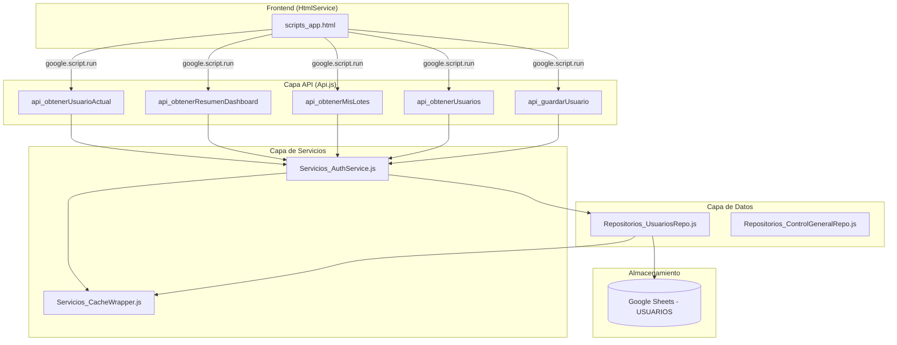
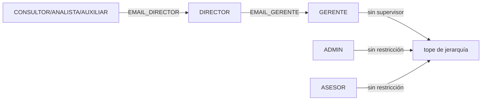
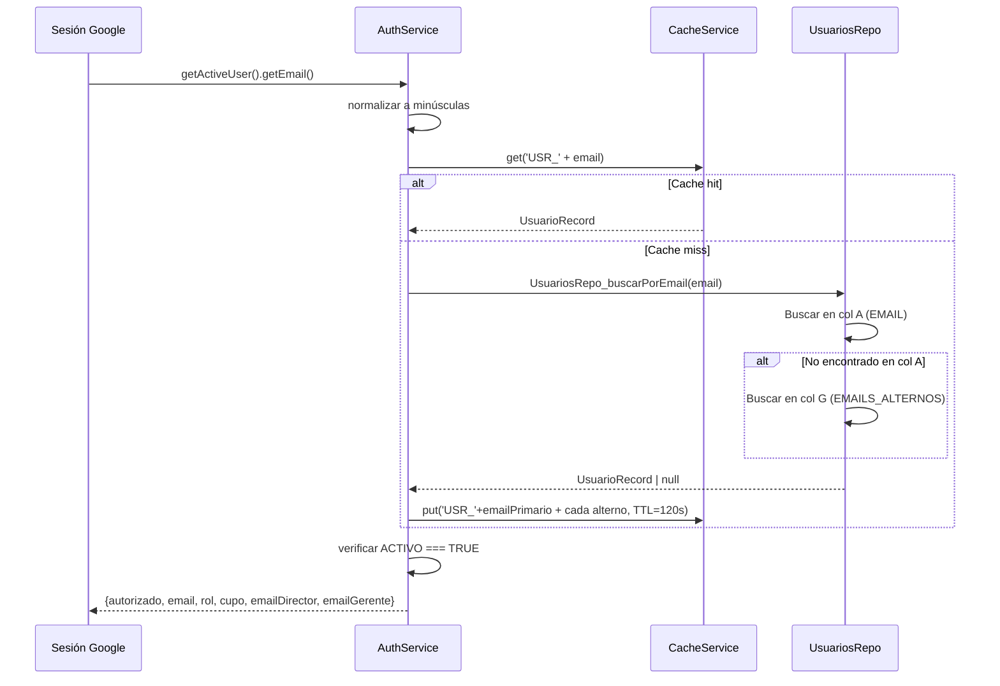
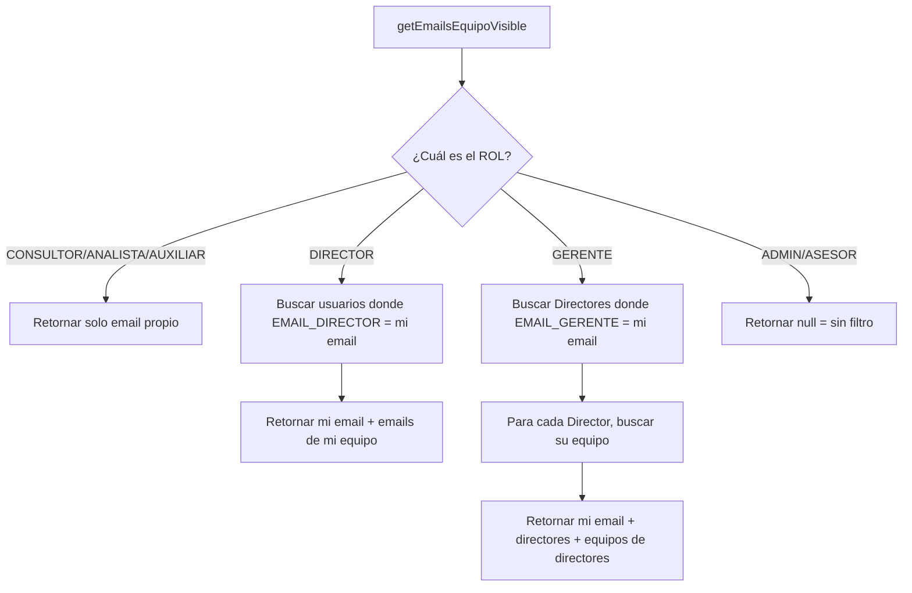

# Documento de Diseño: Usuarios – Jerarquía Unificada

## Overview

Este diseño reestructura el módulo de usuarios del sistema "El Libertador" para reemplazar la estructura plana actual (8 columnas con NOMBRE, BACKUP, BACKUP_ACTIVO) por una jerarquía organizacional explícita de 7 columnas (EMAIL, ROL, ACTIVO, CUPO, EMAIL_DIRECTOR, EMAIL_GERENTE, EMAILS_ALTERNOS). Los cambios principales son:

1. **Nuevo modelo de datos** en la pestaña USUARIOS con cadena de supervisión directa.
2. **AuthService refactorizado** que busca por emails alternos y resuelve jerarquía.
3. **Nuevo UsuariosRepo** para operaciones CRUD sobre la pestaña USUARIOS.
4. **Función de resolución de vista jerárquica** (`getEmailsEquipoVisible`) que determina qué registros son visibles para cada rol.
5. **Script de migración idempotente** para transicionar datos existentes.
6. **Impacto mínimo en APIs** existentes, reemplazando la lógica binaria LIDER/ADMIN por la nueva cadena jerárquica.

## Architecture

### Diagrama de capas



### Decisiones de diseño

| Decisión | Razonamiento |
|----------|-------------|
| Mantener la pestaña USUARIOS como única fuente de verdad | Elimina la pestaña CORREOS como fuente paralela; simplifica mantenimiento |
| Usar EMAIL_DIRECTOR y EMAIL_GERENTE como FK explícitas | Evita joins complejos; resolución O(n) sobre ~50 filas es aceptable |
| Cachear por email primario Y cada alterno | Un usuario con 3 emails alternos generará 4 claves de caché; TTL 120s mantiene consistencia |
| Separar UsuariosRepo del AuthService | Separa responsabilidad: Repo = lectura/escritura de datos, Auth = lógica de acceso |
| Migración idempotente con marca `_MIGRADO_V2` | Permite re-ejecución segura sin duplicar datos |
| Alias temporales COMERCIAL→CONSULTOR, LIDER→DIRECTOR | Período de transición donde el frontend puede enviar los roles viejos |

## Components and Interfaces

### 1. Repositorios_UsuariosRepo.js (NUEVO)

Responsabilidad: Lectura y escritura de la pestaña USUARIOS con el nuevo esquema de 7 columnas.

```javascript
/**
 * Lee todos los usuarios de la pestaña USUARIOS (nuevo esquema 7 columnas).
 * @returns {UsuarioRecord[]}
 */
function UsuariosRepo_leerTodos() {}

/**
 * Busca un usuario por email primario o alterno.
 * @param {string} email - Email normalizado a minúsculas
 * @returns {UsuarioRecord|null}
 */
function UsuariosRepo_buscarPorEmail(email) {}

/**
 * Escribe o actualiza un registro de usuario (7 columnas).
 * @param {UsuarioRecord} datos
 * @param {boolean} esNuevo
 * @returns {{ok: boolean, mensaje: string}}
 */
function UsuariosRepo_guardar(datos, esNuevo) {}

/**
 * Retorna los emails del equipo visible para un usuario dado.
 * Implementa la resolución transitiva de jerarquía.
 * @param {string} emailUsuario
 * @param {string} rol
 * @returns {string[]} Lista de emails visibles
 */
function UsuariosRepo_getEmailsEquipoVisible(emailUsuario, rol) {}

/**
 * Retorna emails de usuarios con roles superiores activos.
 * Reemplazo de obtenerCorreosLideres().
 * @returns {string[]}
 */
function UsuariosRepo_getCorreosSuperiores() {}
```

### 2. Servicios_AuthService.js (REFACTORIZADO)

Responsabilidad: Autenticación, resolución de identidad por alternos y control de acceso.

```javascript
/**
 * Obtiene datos del usuario autenticado.
 * Nuevo flujo: busca primero por EMAIL, luego por EMAILS_ALTERNOS.
 * @returns {{autorizado:boolean, email:string, rol?:string, cupo?:number,
 *            emailDirector?:string, emailGerente?:string}}
 */
function obtenerUsuarioActual_v2() {}

/**
 * Busca usuario por email con lógica de alternos.
 * Cachea bajo TODAS las claves de email del usuario.
 * @param {string} email
 * @returns {UsuarioRecord|null}
 */
function _obtenerUsuarioPorEmail(email) {}

/**
 * Invalida el cache de un usuario (primario + todos sus alternos).
 * @param {UsuarioRecord} usuario
 */
function invalidarCacheUsuario(usuario) {}

/**
 * Retorna la lista de emails visible para el usuario autenticado.
 * Wrapper sobre UsuariosRepo_getEmailsEquipoVisible.
 * @param {string} email
 * @returns {string[]}
 */
function getEmailsEquipoVisible(email) {}

/**
 * Obtiene el correo del director de un usuario dado.
 * Reemplaza la versión anterior que leía de pestaña CORREOS.
 * @param {string} emailUsuario
 * @returns {string}
 */
function obtenerCorreoDeDirector(emailUsuario) {}

/**
 * Obtiene correos de roles superiores activos.
 * Wrapper cacheado en memoria de ejecución.
 * @returns {string[]}
 */
function obtenerCorreosSuperiores() {}

// Alias de transición
function obtenerCorreosLideres() {}
```

### 3. Setup_MigracionV2.js (NUEVO)

Responsabilidad: Script de migración idempotente.

```javascript
/**
 * Migra la pestaña USUARIOS del esquema viejo (8 cols) al nuevo (7 cols).
 * Idempotente: detecta si ya se ejecutó mediante propiedad de script '_MIGRADO_V2'.
 */
function migrarUsuariosAV2() {}

/**
 * Crea la pestaña USUARIOS nueva si no existe, con formato de cabecera.
 */
function _crearPestanaUsuariosV2(ss) {}
```

### 4. Impacto en Api.js

Las funciones API existentes se modifican para usar la nueva resolución jerárquica:

| Función | Cambio |
|---------|--------|
| `api_obtenerUsuarioActual` | Retorna `emailDirector`, `emailGerente` adicionales |
| `api_obtenerResumenDashboard` | Usa `getEmailsEquipoVisible()` en vez de binario `LIDER/ADMIN` |
| `api_obtenerMisLotes` | Filtra por emails del equipo visible |
| `api_obtenerTodosLosLotes` | Filtra por emails del equipo visible |
| `api_obtenerUsuarios` | Filtra por vista jerárquica del solicitante |
| `api_guardarUsuario` | Valida unicidad en EMAIL + EMAILS_ALTERNOS; escribe 7 campos |

### 5. Impacto en Notificaciones

| Función | Cambio |
|---------|--------|
| `obtenerCorreoDeDirector` | Lee de columna EMAIL_DIRECTOR de USUARIOS (ya no de CORREOS) |
| `obtenerCorreoDeBackup` | **ELIMINADA** — reemplazada por CC al Director automático |
| `obtenerCorreosLideres` | Alias de `obtenerCorreosSuperiores()` (DIRECTOR + GERENTE + ADMIN activos) |
| `enviarLasNotificaciones` | CC usa `obtenerCorreoDeDirector()` nuevo + `obtenerCorreosSuperiores()` |
| `enviarCorreoPazYSalvo` | Mismo cambio en CC |
| `enviarRecordatoriosPazYSalvoDiario` | Mismo cambio en CC |

## Data Models

### Pestaña USUARIOS — Esquema nuevo (7 columnas)

| Columna | Header | Tipo | Restricciones | Ejemplo |
|---------|--------|------|---------------|---------|
| A | EMAIL | string | PK, requerido, formato email | ana.perez@segurosbolivar.com |
| B | ROL | enum | CONSULTOR, ANALISTA, AUXILIAR, DIRECTOR, GERENTE, ADMIN, ASESOR | CONSULTOR |
| C | ACTIVO | boolean | TRUE/FALSE | TRUE |
| D | CUPO | number | ≥ 0 | 5 |
| E | EMAIL_DIRECTOR | string | Email válido si ROL ∈ {CONSULTOR, ANALISTA, AUXILIAR} | jenny.ascanio@segurosbolivar.com |
| F | EMAIL_GERENTE | string | Email válido si ROL = DIRECTOR | kharen.garcia@segurosbolivar.com |
| G | EMAILS_ALTERNOS | string | Emails separados por coma | ana.p@gmail.com,aperez@empresa.co |

### Objeto UsuarioRecord (interno)

```javascript
/**
 * @typedef {Object} UsuarioRecord
 * @property {string} email          - Email primario (col A, normalizado a minúsculas)
 * @property {string} rol            - Rol del usuario (col B)
 * @property {boolean} activo        - Estado activo (col C)
 * @property {number} cupo           - Cupo máximo de solicitudes (col D)
 * @property {string} emailDirector  - Email del director supervisor (col E)
 * @property {string} emailGerente   - Email del gerente supervisor (col F)
 * @property {string[]} emailsAlternos - Lista de emails alternos (col G, parseada)
 */
```

### Reglas de integridad referencial



1. Si `ROL ∈ {CONSULTOR, ANALISTA, AUXILIAR}` → `EMAIL_DIRECTOR` debe apuntar a un usuario con `ROL = DIRECTOR` y `ACTIVO = TRUE`.
2. Si `ROL = DIRECTOR` → `EMAIL_GERENTE` debe apuntar a un usuario con `ROL = GERENTE` y `ACTIVO = TRUE`.
3. `EMAILS_ALTERNOS` no puede contener un email que ya exista como EMAIL primario de otro registro.

### Flujo de resolución de identidad



### Flujo de resolución de vista jerárquica



### Mapeo de migración

| Esquema viejo (8 cols) | → | Esquema nuevo (7 cols) |
|------------------------|---|------------------------|
| EMAIL (A) | → | EMAIL (A) |
| NOMBRE (B) | → | **descartado** |
| ROL (C) "COMERCIAL" | → | ROL (B) "CONSULTOR" |
| ROL (C) "LIDER" | → | ROL (B) "DIRECTOR" |
| CUPO (D) | → | CUPO (D) |
| DIRECTOR (E) | → | EMAIL_DIRECTOR (E) |
| BACKUP (F) | → | **descartado** |
| BACKUP_ACTIVO (G) | → | **descartado** |
| ACTIVO (H) | → | ACTIVO (C) |
| — | → | EMAIL_GERENTE (F) *vacío, llenar manualmente* |
| — | → | EMAILS_ALTERNOS (G) *vacío* |

## Error Handling

| Escenario | Estrategia | Resultado para el usuario |
|-----------|-----------|--------------------------|
| Email de sesión no encontrado en EMAIL ni EMAILS_ALTERNOS | Retornar `{autorizado: false}` | Pantalla de acceso denegado |
| Usuario encontrado pero ACTIVO = FALSE | Retornar `{autorizado: false}` | Pantalla de acceso denegado |
| EMAIL_DIRECTOR apunta a un Director inactivo | Log WARN; CC se omite | Notificación se envía sin CC del director |
| Colisión de email alterno con primario de otro usuario | Rechazar con mensaje específico | "El email X ya está registrado como primario de otro usuario" |
| Pestaña USUARIOS no existe | Log ERROR; retornar array vacío | Dashboard vacío; alert de salud del sistema |
| CacheService no disponible | Degradación elegante (leer directamente de Sheets) | Sin impacto funcional, solo latencia |
| Migración ejecutada sobre esquema ya migrado | Detectar `_MIGRADO_V2` y salir sin cambios | Log informativo "Ya migrado" |
| ROL inválido recibido en api_guardarUsuario | Validar contra enum; rechazar | "Rol no permitido: X" |
| Ciclos en la cadena de supervisión | No se valida (improbable con ~50 usuarios) | — |

## Correctness Properties

*Una propiedad es una característica o comportamiento que debe mantenerse verdadero en todas las ejecuciones válidas de un sistema — esencialmente, una declaración formal sobre lo que el sistema debe hacer. Las propiedades sirven como puente entre especificaciones legibles por humanos y garantías de correctitud verificables por máquina.*

### Property 1: Validación de ROL contra enum

*Para cualquier* string proporcionado como valor de ROL, la función de validación SHALL aceptarlo si y solo si pertenece al conjunto {CONSULTOR, ANALISTA, AUXILIAR, DIRECTOR, GERENTE, ADMIN, ASESOR}. Cualquier otro valor SHALL ser rechazado.

**Validates: Requirements 1.3, 6.4**

### Property 2: Campos de supervisor condicionalmente requeridos

*Para cualquier* UsuarioRecord, si el ROL ∈ {CONSULTOR, ANALISTA, AUXILIAR} entonces EMAIL_DIRECTOR debe ser un email válido no vacío; si ROL = DIRECTOR entonces EMAIL_GERENTE debe ser un email válido no vacío; si ROL ∈ {GERENTE, ADMIN, ASESOR} entonces no se requiere campo de supervisor.

**Validates: Requirements 1.5, 1.6**

### Property 3: Resolución de identidad por email primario y alternos

*Para cualquier* conjunto de usuarios y cualquier email que coincida con un EMAIL primario o que esté contenido en EMAILS_ALTERNOS de un usuario con ACTIVO = TRUE, la función `_obtenerUsuarioPorEmail` SHALL retornar el UsuarioRecord correspondiente al Email_Primario de ese usuario, con todos sus campos correctos.

**Validates: Requirements 2.2, 2.3, 2.4**

### Property 4: Acceso denegado para emails sin coincidencia o usuarios inactivos

*Para cualquier* email que no exista ni como EMAIL primario ni dentro de EMAILS_ALTERNOS de ningún registro, O que corresponda a un usuario con ACTIVO = FALSE, el sistema SHALL retornar `{autorizado: false}`.

**Validates: Requirements 2.5, 2.6**

### Property 5: Resolución transitiva de vista jerárquica

*Para cualquier* jerarquía de usuarios y cualquier usuario con ROL = DIRECTOR, `getEmailsEquipoVisible` SHALL retornar exactamente {email propio} ∪ {emails de usuarios cuyo EMAIL_DIRECTOR = email del Director}. Para ROL = GERENTE, SHALL retornar {email propio} ∪ {emails de Directores cuyo EMAIL_GERENTE = email del Gerente} ∪ {transitivamente, los equipos de esos Directores}. Para ROL = CONSULTOR/ANALISTA/AUXILIAR, SHALL retornar solo {email propio}.

**Validates: Requirements 3.1, 3.2, 3.3**

### Property 6: Vista sin filtro para roles globales

*Para cualquier* usuario con ROL = ADMIN o ASESOR, `getEmailsEquipoVisible` SHALL retornar null (indicando acceso total sin filtro), independientemente de la composición del dataset de usuarios.

**Validates: Requirements 3.5, 6.6**

### Property 7: CC de notificación resuelve al supervisor correcto

*Para cualquier* Consultor/Analista/Auxiliar con un EMAIL_DIRECTOR válido en su registro, la función `obtenerCorreoDeDirector` SHALL retornar exactamente ese valor de EMAIL_DIRECTOR. Para un Director con EMAIL_GERENTE válido, la función SHALL retornar el EMAIL_GERENTE como CC adicional.

**Validates: Requirements 4.1, 4.2, 4.3**

### Property 8: Migración preserva datos y transforma roles

*Para cualquier* dataset en esquema viejo (8 columnas), después de ejecutar `migrarUsuariosAV2`, los valores de EMAIL y CUPO SHALL permanecer idénticos, ACTIVO SHALL preservar su valor booleano, ROL "COMERCIAL" SHALL ser "CONSULTOR", ROL "LIDER" SHALL ser "DIRECTOR", y el valor de la columna DIRECTOR vieja SHALL estar en EMAIL_DIRECTOR.

**Validates: Requirements 5.1, 5.2, 5.3, 5.5**

### Property 9: Idempotencia de la migración

*Para cualquier* dataset, ejecutar `migrarUsuariosAV2` dos veces SHALL producir exactamente el mismo resultado que ejecutarla una sola vez (f(f(x)) = f(x)).

**Validates: Requirements 5.6**

### Property 10: Unicidad de email en todo el sistema

*Para cualquier* conjunto de usuarios existente y un nuevo email propuesto, `api_guardarUsuario(esNuevo=true)` SHALL rechazar la creación si el email ya existe como EMAIL primario de otro registro O si está contenido en EMAILS_ALTERNOS de otro registro.

**Validates: Requirements 6.1**

### Property 11: Round-trip de guardado/lectura de usuario

*Para cualquier* UsuarioRecord válido, guardar el registro con `UsuariosRepo_guardar` y luego leerlo con `UsuariosRepo_buscarPorEmail` SHALL producir un objeto con los mismos 7 campos (email, rol, activo, cupo, emailDirector, emailGerente, emailsAlternos).

**Validates: Requirements 6.2**

### Property 12: Invalidación de cache cubre todos los emails del usuario

*Para cualquier* usuario con N emails alternos, al invocar `invalidarCacheUsuario`, el sistema SHALL eliminar exactamente N+1 claves de cache (1 primario + N alternos).

**Validates: Requirements 2.7, 6.3**

### Property 13: obtenerCorreosSuperiores retorna roles superiores activos

*Para cualquier* dataset de usuarios, `obtenerCorreosSuperiores()` SHALL retornar exactamente el conjunto de emails donde ROL ∈ {DIRECTOR, GERENTE, ADMIN} y ACTIVO = TRUE, sin duplicados y sin incluir usuarios de otros roles.

**Validates: Requirements 8.1**

### Property 14: Alias de roles legacy se resuelven correctamente

*Para cualquier* verificación de permisos que reciba "COMERCIAL" como rol, el sistema SHALL tratarlo como equivalente a "CONSULTOR". Para "LIDER", SHALL tratarlo como equivalente a "DIRECTOR".

**Validates: Requirements 7.5**


## Testing Strategy

### Enfoque Dual

Este feature se beneficia de property-based testing (PBT) porque:
- La lógica de resolución de identidad y jerarquía es **pura** (entrada → salida determinística).
- El espacio de inputs es amplio (combinaciones de roles, emails, estados, cadenas de supervisión).
- Las propiedades son universales (deben cumplirse para cualquier combinación válida de usuarios).

### Framework y Configuración

| Aspecto | Detalle |
|---------|---------|
| Framework | Vitest + fast-check 3.x |
| Ubicación tests unitarios | `tests/unit/usuarios-repo.test.js`, `tests/unit/auth-service-v2.test.js` |
| Ubicación tests de propiedades | `tests/properties/usuarios-jerarquia.property.js` |
| Generadores | `tests/properties/generators/usuario-record.gen.js` |
| Iteraciones mínimas por propiedad | 100 |
| Tag de cada propiedad | `Feature: usuarios-jerarquia-unificada, Property N: <texto>` |

### Tests de Propiedades (PBT)

Cada propiedad del diseño (P1–P14) se implementa como UN test de fast-check con mínimo 100 iteraciones:

```javascript
// Ejemplo estructura de un test de propiedad
import { describe, it } from 'vitest';
import fc from 'fast-check';

describe('Feature: usuarios-jerarquia-unificada', () => {
  it('Property 5: Resolución transitiva de vista jerárquica', () => {
    fc.assert(
      fc.property(
        arbJerarquiaUsuarios(), // generador de jerarquía aleatoria
        (jerarquia) => {
          // Para cada Director, verificar que getEmailsEquipoVisible
          // retorna exactamente su equipo directo + él mismo
          // ...
        }
      ),
      { numRuns: 100 }
    );
  });
});
```

### Generadores Requeridos

| Generador | Propósito |
|-----------|-----------|
| `arbUsuarioRecord()` | UsuarioRecord válido con email, rol, y campos condicionales |
| `arbJerarquiaUsuarios()` | Dataset completo con relaciones Gerente→Director→Subordinados |
| `arbEmailNormalizado()` | Email aleatorio normalizado a minúsculas |
| `arbEmailsAlternos()` | Lista de 0-5 emails alternos separados por coma |
| `arbDatosEsquemaViejo()` | Filas en el formato viejo (8 columnas) para tests de migración |
| `arbRolValido()` | Uno de los 7 valores enum permitidos |
| `arbRolInvalido()` | String aleatorio que NO esté en el enum de roles |

### Tests Unitarios (Ejemplo-Based)

| Área | Tests |
|------|-------|
| Setup USUARIOS | Verificar headers correctos, formato, idempotencia |
| Migración | Edge case: pestaña vacía, datos ya migrados, roles mixtos |
| API guardarUsuario | Crear con campos vacíos, email duplicado, rol inválido |
| Frontend alias | COMERCIAL → CONSULTOR, LIDER → DIRECTOR |
| Notificaciones CC | Director inactivo → CC omitido, EMAIL_DIRECTOR vacío |

### Tests de Integración

| Escenario | Verificación |
|-----------|-------------|
| Flujo completo de auth | Desde Session.getActiveUser() hasta respuesta autorizada |
| Dashboard con jerarquía | Director ve solo sus datos, ADMIN ve todo |
| Guardar y leer usuario | Round-trip a través de Api.js + Repo |

### Mocks Requeridos

- `CacheService.getScriptCache()` → mock existente en `tests/mocks/cache-service.mock.js`
- `SpreadsheetApp.openById()` → mock existente en `tests/mocks/spreadsheet-app.mock.js`
- `Session.getActiveUser().getEmail()` → mock simple que retorna un email configurable
- `LockService.getScriptLock()` → mock existente en `tests/mocks/lock-service.mock.js`
